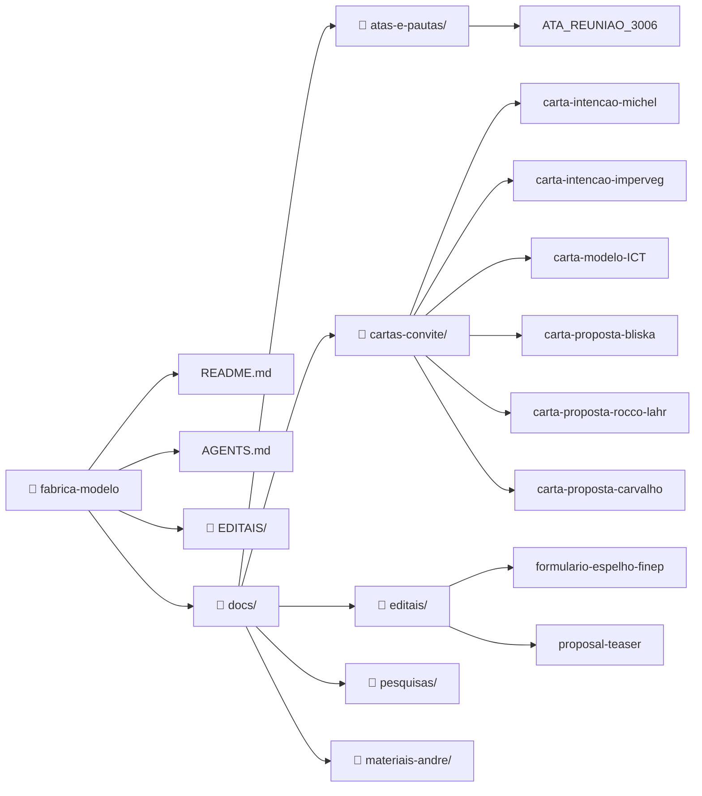

# 🏭 Fábrica Modelo — Fábrica Escola

> **Ação conjunta** para industrialização da construção civil com redução de impacto ambiental.
> Proposta ao edital **FINEP Mais Inovação** (Economia Circular — Linha 4: Moradia Sustentável).
> **Prazo de submissão:** 31/08/2026

---

## 📋 Sobre o Projeto

Este repositório reúne a articulação do **Grupo Executor Fábrica Modelo** para viabilizar o projeto de **Fábrica Escola** proposto por André Blanco — uma planta fabril para industrialização da construção civil que integre:

1. **Sistema construtivo patenteado** de painéis arquitetônicos estruturais (mais rápido, menos concreto e aço)
2. **Linha paralela de P&D** em materiais renováveis: bambu tratado, PU Vegetal (mamona), biocompósitos com resíduos agrícolas e plásticos
3. **Assistência Técnica Integrada (ATI)** — conectando habitação, alimentação e saúde

> ⚠️ **Esclarecimento:** O projeto tem como escopo a **certificação de processos** e a prototipagem financiada pelo edital. A **transferência de tecnologia** ocorrerá como ação paralela, por meio de cursos nas ICTs parceiras para divulgação dos resultados obtidos com a prototipagem. Não se trata de operação logística remota — o manejo e a difusão serão feitos via capacitação, não via deslocamento de materiais ou equipes.

### Políticas Nacionais Relacionadas

O projeto está alinhado a três marcos legais que fundamentam sua relevância e pontuação no edital:

| Política | Legislação | Relação com o Projeto |
|----------|------------|----------------------|
| **PNMCB** — Política Nacional de Manejo Sustentado e Cultivo do Bambu | Lei 12.484/2011 · Decreto 8.375/2014 | Uso estrutural do bambu tratado (vapor alcalino + pirolenhoso) em painéis, fechamentos e geodésicas — substituindo madeira nativa e aço |
| **PNRS** — Política Nacional de Resíduos Sólidos | Lei 12.305/2010 · Decreto 11.413/2023 | Incorporação de resíduos agrícolas, plásticos e minerais como insumo — Parcerias Sociais com cooperativas de catadores (Anexo 6 edital FINEP) |
| **Estratégia Nacional de Bioeconomia** | Decreto 12.044/2024 | Tecnologias sociais para comunidades tradicionais, agricultores familiares, povos indígenas e quilombolas |

Valor do projeto: **R$ 5.000.000,00 a R$ 10.000.000,00** · Subvenção FINEP + contrapartida das empresas proponentes.

---

## 🏗️ Parceiros Atuais

| Parceiro | Papel | Contato |
|----------|-------|---------|
| **André Blanco** (IFSP) | Coordenação técnica, articulação ICT, ABNT Comissão 6263 | Via repositório |
| **Maurilio Chiaretti** | Articulação política, Fed. Nacional dos Arquitetos, habitação social | Via repositório |
| **Michel / Texos** | Proponente candidato — tecnologia painéis (patente CDHU/Caixa) | Via repositório |
| **Fabio Takwara** | Assessoria técnico-científica, curadoria, redação da proposta | fabiotakwara@gmail.com |

---

## 🎯 Buscamos Parceiros

### Para atingir o valor mínimo do edital (R$ 5M), buscamos:

#### 1. Empresa(s) proponente(s) com capacidade de contrapartida

A contrapartida é **exclusivamente financeira** (não imaterial). O valor mínimo do projeto é **R$ 5.000.000,00**. A contrapartida exigida varia conforme porte da empresa:

| Porte da empresa | Faturamento anual | Contrapartida | Valor em R$ 5M |
|------------------|-------------------|---------------|----------------|
| Microempresa | Até R$ 4,8M | 5% | R$ 250.000 |
| Pequeno porte | R$ 4,8M a R$ 10M | 10% | R$ 500.000 |
| Demais | Acima de R$ 10M | Até 50% | Até R$ 2.500.000 |

**Cenários possíveis:**
- 1 empresa de médio porte (R$ 500K) + 1 micro (R$ 250K) = R$ 750K → **viabiliza projeto de R$ 7,5M**
- 3 microempresas (R$ 250K cada) = R$ 750K → **viabiliza projeto de R$ 7,5M**
- 1 empresa de grande porte → contrapartida única suficiente para R$ 10M

#### 2. ICT parceira (obrigatória)

ICTs em prospecção com perfis mapeados (vide seção abaixo).

#### 3. Parcerias Sociais (pontuação extra)

Cooperativas de catadores, associações de pequenos produtores, agricultores familiares — pontuam no critério **Parcerias Sociais** (nota 0-1, peso 1). Alinhamento com PNRS (Lei 12.305/2010) e Decreto 12.044/2024 (Bioeconomia).

---

## 🔬 ICTs em Prospecção

Pesquisa aprofundada realizada via Gemini Deep Research em 01/07/2026. Perfis completos no Acervo Científico.

### Prioridade Máxima

| ICT | Nota | Pesquisador-chave | Linha de Pesquisa | Contato |
|-----|------|-------------------|-------------------|---------|
| **USP EESC** (São Carlos) | ⭐5 | **Francisco Rocco Lahr** | PU de mamona, painéis OSB, aglomerados com resíduos | ❌ A contatar |
| **USP FZEA** (Pirassununga) | ⭐5 | **Juliano Fiorelli** · **Holmer Savastano** | Bambu + resina PU, painéis sustentáveis, fibrocimentos | ❌ A contatar |
| **UFSCar** (São Carlos) | ⭐5 | **A. J. F. Carvalho** | Biopolímeros, PU, compósitos com fibras vegetais | ❌ A contatar |
| **UNICAMP** (Campinas) | ⭐5 | **Antonio Bliska Jr.** | Plasticultura, estufas, ambientes protegidos | ✅ Contato direto |
| **CEFET-MG** (B. Horizonte) | ⭐4 | Incubadora Nascente | Quartzito + PU vegetal (histórico de parceria) | ✅ Contato (Nascente) |
| **IPT** (São Paulo) | ⭐4 | Marcelo Guedes | Certificação, laudos normativos | ✅ Contato direto |
| **UFLA** (Lavras) | ⭐4 | **Lourival Marin Mendes** | Painéis aglomerados + resinas PU mamona | ❌ A contatar |
| **UNESP** (Ilha Solteira) | ⭐3 | **Jorge Akasaki** | Resíduos sólidos em materiais de construção | ❌ A contatar |

📄 Pesquisa completa: [`docs/pesquisas-ict/pesquisa-gemini-deep-research-icts.md`](docs/pesquisas-ict/pesquisa-gemini-deep-research-icts.md)
📄 Perfis dos pesquisadores: [Acervo Científico — 08_perfis-referencias](https://github.com/takwaratec/Analises-e-escrita-cientifica/tree/main/docs/analises/08_perfis-referencias)

---

## 📊 Critérios de Avaliação do Edital

A nota final da proposta é a soma ponderada dos indicadores abaixo. Entender estes critérios é essencial para orientar a articulação de parcerias.

### Fase 1 — Habilitação (eliminatória)
- **Consistência da Proposta** (✅/❌) — Adequação da equipe, TRL, metodologia, metas, orçamento, prazos

### Fase 2 — Classificação (nota 0-2 por indicador, peso 1)

**Grau de Inovação** (soma simples):
| Indicador | O que avalia | Como pontuamos |
|-----------|-------------|----------------|
| Abrangência | Ineditismo mundial (2), nacional (1) ou apenas na empresa (0) | Patente Michel é nacional; PU+bambu+resíduos alinhado à PNMCB (Lei 12.484/2011) e PNRS (Lei 12.305/2010) — inovação com lastro em política pública |
| Grau de Incerteza Tecnológica | Quanto maior o risco tecnológico, maior a nota | TRL 4-5 (médio risco); validar com ICT aumenta confiança |
| Qualificação da Equipe | Participação de mestres e doutores | Entrar com ICT traz doutores ao time |
| Composição dos Dispêndios | Despesas em atividades intensivas em conhecimento | P&D em ICT e laboratórios |
| Trajetória de Inovação da Empresa | Histórico de inovação da proponente | Michel já tem patente e processo IPT |

**Relevância da Inovação** (soma simples):
| Indicador | O que avalia | Como pontuamos |
|-----------|-------------|----------------|
| Relevância do Tema | Alinhamento com políticas do Estado brasileiro | Déficit habitacional, PNRS, bioeconomia — alinhamento forte |
| Impacto na Estrutura de Mercado | Impactos na cadeia produtiva | Industrialização + materiais renováveis = disrupção positiva |
| Parceria com ICTs | Intensidade da parceria ICT-empresa | ⚠️ **Quanto mais ICTs, melhor** — justifica buscar múltiplos parceiros |
| Internacionalização | Potencial de mercado internacional | Tecnologia com apelo global (construção sustentável) |
| Externalidades | Impactos ambientais, sociais, econômicos | Redução de CO₂, habitação social, resíduos como insumo |

**Bônus**:
| Indicador | Nota | Como obter |
|-----------|------|------------|
| Regionalização (0-1) | 1 se projeto na região N/NE/CO | SP e MG não pontuam neste critério |
| **Parcerias Sociais (0-1)** | 1 se houver | **Cooperativas de catadores, associações, agricultura familiar** — alinhamento com MST, Terra Viva, catadores de recicláveis |

### Estratégia Recomendada

```
Máximo de pontos possível (fora regionalização):
  Grau Inovação: 5 indicadores × 2 = 10 pts
  Relevância:    5 indicadores × 2 = 10 pts  
  Parcerias Sociais:              =  1 pt
  TOTAL MÁXIMO:                   = 21 pts
```

Para maximizar a nota:
1. ✅ **Fechar ICT(s) rapidamente** — pontua em Parceria com ICTs + Qualificação da Equipe
2. ✅ **Incluir Parceria Social** — MST/Terra Viva já são parceiros, formalizar como coexecutor
3. ✅ **Documentar trajetória de inovação** — patente Michel + histórico IPT
4. ✅ **Enfatizar externalidades** — impacto ambiental (CO₂), social (HIS), econômico (industrialização)

---

## 📁 Estrutura do Repositório



**Documentos principais com acesso direto (clique no diagrama):**

| Documento | Link |
|-----------|------|
| 📄 README | [README.md](https://github.com/takwaratec/fabrica-modelo) |
| 📄 ATA da Reunião | [atas-e-pautas/ATA_REUNIAO_3006.md](https://github.com/takwaratec/fabrica-modelo/blob/main/docs/atas-e-pautas/ATA_REUNIAO_3006.md) |
| 📄 Carta Bliska (UNICAMP) | [cartas-convite/carta-proposta-bliska.md](https://github.com/takwaratec/fabrica-modelo/blob/main/docs/cartas-convite/carta-proposta-bliska.md) |
| 📄 Carta Rocco Lahr (USP) | [cartas-convite/carta-proposta-rocco-lahr-usp.md](https://github.com/takwaratec/fabrica-modelo/blob/main/docs/cartas-convite/carta-proposta-rocco-lahr-usp.md) |
| 📄 Carta Carvalho (UFSCar) | [cartas-convite/carta-proposta-carvalho-ufscar.md](https://github.com/takwaratec/fabrica-modelo/blob/main/docs/cartas-convite/carta-proposta-carvalho-ufscar.md) |
| 📄 Formulário Espelho FINEP | [editais/formulario-espelho-finep.md](https://github.com/takwaratec/fabrica-modelo/blob/main/docs/editais/formulario-espelho-finep.md) |
| 📄 Proposal Teaser | [editais/proposal-teaser.md](https://github.com/takwaratec/fabrica-modelo/blob/main/docs/editais/proposal-teaser.md) |

---

## 🔗 Acesso aos Documentos

| Documento | Local |
|-----------|-------|
| **Acervo Científico** (fichas, perfis, referências) | [github.com/takwaratec/Analises-e-escrita-cientifica](https://github.com/takwaratec/Analises-e-escrita-cientifica) |
| **Índice do projeto no Acervo** | [Acervo — fabrica-modelo/index.md](https://github.com/takwaratec/Analises-e-escrita-cientifica/blob/main/docs/analises/fabrica-modelo/index.md) |
| **Pesquisa ICTs completa** | [`docs/pesquisas/pesquisas-ict/pesquisa-gemini-deep-research-icts.md`](docs/pesquisas/pesquisas-ict/pesquisa-gemini-deep-research-icts.md) |

---

## 📬 Contato

**Grupo Executor Fábrica Modelo**
André Blanco · Maurilio Chiaretti · Michel (Texos) · Fabio Takwara

Interessados em compor o projeto como proponente, ICT parceira ou parceria social:
→ Abrir issue neste repositório ou contatar Fabio Takwara (fabiotakwara@gmail.com)

---

*Criado: 29/06/2026 · Atualizado: 01/07/2026 · Tecnologia Takwara*
*Este repositório é público — documentos do projeto para parceiros e avaliadores.*
