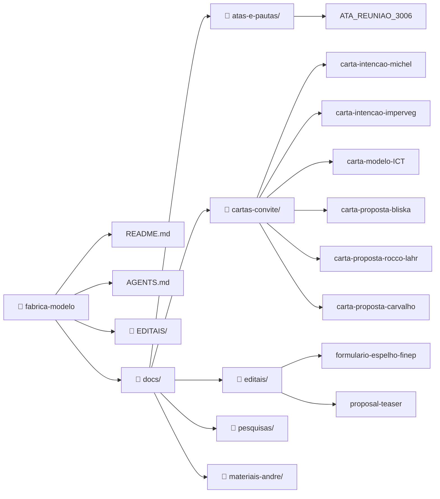

# 🏭 Fábrica Modelo — Fábrica Escola

> **Ação conjunta** para industrialização da construção civil com redução de impacto ambiental.
> Proposta ao edital **FINEP Mais Inovação** (Economia Circular — Linha 4: Moradia Sustentável).
> **Prazo de submissão:** 31/08/2026

---

## 📋 Sobre o Projeto

Este repositório reúne a articulação do **Grupo Executor Fábrica Modelo** para viabilizar o projeto de **Fábrica Escola** proposto por André Blanco — uma planta fabril para industrialização da construção civil que integre:

1. **Sistema construtivo patenteado** de painéis arquitetônicos estruturais (mais rápido, menos concreto e aço)
2. **Linha paralela de P&D** em materiais renováveis: bambu tratado, PU Vegetal (mamona), biocompósitos com resíduos agrícolas e plásticos
3. **Assistência Técnica Integrada (ATI)** — conectando habitação, alimentação e saúde

> ⚠️ **Esclarecimento:** A **Fábrica Escola** será sediada em São Paulo, em local a ser definido por André Blanco e Maurilio Chiaretti. O projeto FINEP financia a prototipagem e a certificação de processos — os testes e ensaios podem ocorrer nas ICTs parceiras (em outros estados), mas a planta fabril fica em SP. A transferência de tecnologia proporá os **protocolos de manejo e processos de fabricação/beneficiamento** por meio de cursos orçados e inclusos na grade de execução da proposta. Não se trata de deslocamento da operação para outros estados — a difusão é via capacitação formal no escopo do projeto.

### Políticas Nacionais Relacionadas

O projeto está alinhado a três marcos legais que fundamentam sua relevância e pontuação no edital:

| Política | Legislação | Relação com o Projeto |
|----------|------------|----------------------|
| **PNMCB** — Política Nacional de Manejo Sustentado e Cultivo do Bambu | Lei 12.484/2011 · Decreto 8.375/2014 | Uso estrutural do bambu tratado (vapor alcalino + pirolenhoso) em painéis, fechamentos e geodésicas — substituindo madeira nativa e aço |
| **PNRS** — Política Nacional de Resíduos Sólidos | Lei 12.305/2010 · Decreto 11.413/2023 | Incorporação de resíduos agrícolas, plásticos e minerais como insumo — Parcerias Sociais com cooperativas de catadores (Anexo 6 edital FINEP) |
| **Estratégia Nacional de Bioeconomia** | Decreto 12.044/2024 | Tecnologias sociais para comunidades tradicionais, agricultores familiares, povos indígenas e quilombolas |

### Impacto Social e Consentimento

O projeto prevê a **inclusão de comunidades, assentamentos e territórios** como beneficiários das ações de difusão. Instituições como **ESECAE**, **APAs (Labiapa)**, **Mário Lago** e outros candidatos que demonstrarem interesse entram no escopo de atendimento do projeto mediante **CLPI (Consentimento Livre, Prévio e Informado)** ou outra forma de consentimento e inclusão formal.

A **avaliação de impacto social** será estruturada com o suporte das ferramentas da **Dra. Daniela Maciel (Embrapa Territorial)**, membro do **ECOSALA** — iniciativa de pesquisadores e educadores cuja atuação abrange o Mário Lago, demais assentamentos já identificados e o próprio edital da FINEP:

- 🔗 [Perfil Daniela Maciel](https://github.com/takwaratec/Analises-e-escrita-cientifica/blob/main/docs/analises/ecosala/daniela-maciel.md) — Doutora em Política Científica e Tecnológica (Unicamp), especialista em avaliação de impacto e inovação agrícola
- 🔗 [TerImpact Ex-Ante](https://github.com/takwaratec/Analises-e-escrita-cientifica/blob/main/docs/analises/ecosala/ficha-terimpact-exante.md) — Ferramenta de avaliação ex-ante de projetos de pesquisa (código aberto)
- 🔗 [AgroRadarEval](https://github.com/takwaratec/Analises-e-escrita-cientifica/blob/main/docs/analises/ecosala/ficha-agroradareval.md) — Gestão de P&D orientada a impacto societal (RRI/RRA)

Valor do projeto: **R$ 5.000.000,00 a R$ 10.000.000,00** · Subvenção FINEP + contrapartida das empresas proponentes.

---

## 🏗️ Parceiros Atuais e Proponentes

| Papel | Parceiro | Contato |
|-------|----------|---------|
| **Grupo Executor** | **André Blanco** (IFSP), **Maurilio Chiaretti** (FNA), **Fabio Takwara** (Ecolaborativa) | fabiotakwara@gmail.com |
| **Proponente candidato** | **Michel / Texos** — tecnologia painéis (patente CDHU/Caixa) | Via repositório |

---

## 🎯 Buscamos Parceiros

### Para atingir o valor mínimo do edital (R$ 5M), buscamos:

#### 1. Empresa(s) proponente(s) com capacidade de contrapartida

A contrapartida é **exclusivamente financeira** (não imaterial). O valor mínimo do projeto é **R$ 5.000.000,00**. A contrapartida exigida varia conforme porte da empresa:

| Porte da empresa | Faturamento anual | Contrapartida | Valor em R$ 5M |
|------------------|-------------------|---------------|----------------|
| Microempresa | Até R$ 4,8M | 5% | R$ 250.000 |
| Pequeno porte | R$ 4,8M a R$ 10M | 10% | R$ 500.000 |
| Demais | Acima de R$ 10M | Até 50% | Até R$ 2.500.000 |

**Cenários possíveis:**
- 1 empresa de médio porte (R$ 500K) + 1 micro (R$ 250K) = R$ 750K → **viabiliza projeto de R$ 7,5M**
- 3 microempresas (R$ 250K cada) = R$ 750K → **viabiliza projeto de R$ 7,5M**
| 1 empresa de grande porte → contrapartida única suficiente para R$ 10M

#### 2. ICT parceira (obrigatória)

ICTs em prospecção com perfis mapeados (vide seção abaixo).

#### 3. Parcerias Sociais (pontuação extra)

Cooperativas de catadores, associações de pequenos produtores, agricultores familiares — pontuam no critério **Parcerias Sociais** (nota 0-1, peso 1). Alinhamento com PNRS (Lei 12.305/2010) e Decreto 12.044/2024 (Bioeconomia).

---

## 👥 ECOSALA — Quadro de Pessoas

O **ECOSALA** reúne pesquisadores, educadores e técnicos com atuação em agroecologia, bambu, bioenergia, avaliação de impacto e educação do campo. Abaixo, o fluxo completo de engajamento de cada pessoa — da prospecção ao aceite ou recusa — com total transparência.

### ✅ Membros Ativos

Pessoas com vínculo confirmado no projeto:

| Membro | Instituição | Enviado por | Resposta | Frente |
|--------|-------------|-------------|----------|--------|
| **Prof. Dr. Marcos Paron** | IFSP | André Blanco | Aceito | Coord. ECOSALA, biochar, compostagem |
| **Profa. Dra. Daniela Maciel** | Embrapa | Gisele Vilela | Aceito | Métricas de impacto social |
| **Dra. Gisele Vilela** | Embrapa | Marcos Paron | Aceito | Remineralizadores, biocompósitos |
| **Prof. Dr. Vicente Virgolino** | IFB | Fabio Takwara | Confirmado (ECOSALA) · aguardando carta formal | Forno ecológico, tratamento bambu |
| **André Blanco** (Me.) | IFSP / TEIA | — | [Fundador] | Coord. técnica, articulação ICT |
| **Maurilio Chiaretti** | FNA / Sind. Arq. | André Blanco | Aceito | Articulação política, HIS |
| **Fabio Takwara** | Ecolaborativa | André Blanco | Aceito | Assessoria técnico-científica |

📄 Perfis completos no Acervo: [Índice Fábrica Modelo](https://github.com/takwaratec/Analises-e-escrita-cientifica/blob/main/docs/analises/fabrica-modelo/index.md)

### 🔄 Prospecção em Andamento

Pessoas em processo de aproximação — pública e rastreável. Cada linha reflete o estágio real do engajamento:

| Prospecto | Instituição | Status | Enviado por | Resposta / Link |
|-----------|-------------|--------|-------------|-----------------|
| **Profa. Dra. Tânia Cruz** | UnB / LaPCiS | 📄 Carta pronta | **Fabio Takwara** | [Aguardando envio até 03/07](docs/cartas-convite/carta-proposta-tania-cruz.md) |
| **Dra. Ludmila A. Correia** | CAU/DF | 📄 Carta pronta | **Fabio Takwara** | [Aguardando envio até 03/07](docs/cartas-convite/carta-proposta-ludmila-correia.md) |
| **Prof. Dr. Antonio Bliska Jr.** | UNICAMP / FEAGRI | 📄 Carta pronta | **André Blanco** | [Aguardando envio até 03/07](docs/cartas-convite/carta-proposta-bliska.md) |
| **Prof. Dr. Francisco Rocco Lahr** | USP EESC | 📄 Carta pronta | **André Blanco** | [Aguardando envio até 03/07](docs/cartas-convite/carta-proposta-rocco-lahr-usp.md) |
| **Prof. Dr. A. J. F. Carvalho** | UFSCar DEMA | 📄 Carta pronta | **André Blanco** | [Aguardando envio até 03/07](docs/cartas-convite/carta-proposta-carvalho-ufscar.md) |
| **Prof. Dr. Marcondes L. Costa** | UFAC | 📄 Carta pronta | **Tânia Cruz** | [Aguardando envio até 03/07](docs/cartas-convite/carta-proposta-marcondes-costa-ufac.md) |
| **Prof. Dr. Romildo Toledo Filho** | UFRJ / COPPE | 📄 Carta pronta | **André Blanco** | [Aguardando envio até 03/07](docs/cartas-convite/carta-proposta-romildo-toledo-ufrj.md) |
| **Prof. Dr. Guilherme O. Silva** | UFBA | 📄 Carta pronta | **Tânia Cruz** | [Aguardando envio até 03/07](docs/cartas-convite/carta-proposta-guilherme-silva-ufba.md) |
| **Prof. Dr. Humberto C. Furtado** | UFSC | 📄 Carta pronta | **Vicente Virgolino** | [Aguardando envio até 03/07](docs/cartas-convite/carta-proposta-humberto-furtado-ufsc.md) |
| **Prof. Dr. Alan P. Oliveira** | IF Goiano | 📄 Carta pronta | **Vicente Virgolino** | [Aguardando envio até 03/07](docs/cartas-convite/carta-proposta-alan-oliveira-ifgoiano.md) |
| **Imperveg Polímeros Vegetais** | Aguaí, SP | 📄 Carta pronta | **Fabio Takwara** | [Aguardando envio até 03/07](docs/cartas-convite/carta-intencao-imperveg.md) |
| **Kehlcoat (Kehl Polímeros)** | São Carlos, SP | 📄 Carta pronta | **Fabio Takwara** | [Aguardando envio até 03/07](docs/cartas-convite/carta-cooperacao-kehl.md) |
| **Purcom Química** | Barueri, SP | 📄 Carta pronta | **Fabio Takwara** | [Aguardando envio até 03/07](docs/cartas-convite/carta-cooperacao-purcom.md) |
| **IPT (Marcelo Guedes)** | São Paulo, SP | 📄 Carta pronta | **André Blanco** | [⚠️ E-mail pendente — André tem o contato](docs/cartas-convite/carta-proposta-ipt.md) |
| **Prof. Dr. Lourival Marin Mendes** | UFLA | 🔍 Em prospecção | — | Sem carta ainda |
| **Prof. Dr. Juliano Fiorelli** | USP FZEA | 🔍 Em prospecção | — | Sem carta ainda |
| **Joaquim Sando** | MST | 🔄 Contato inicial | Marcos Paron | Pendente |
| **Murilo Miguel** | Terra Viva | 🔄 Contato inicial | Marcos Paron | Pendente |
| **Raphaela Palma** | ECOSALA | ⏳ Dados pendentes | — | Aguardando CPF/LinkedIn de Paron |
| **Luci Okino** | ECOSALA | ⏳ Dados pendentes | — | Aguardando CPF/LinkedIn de Paron |
| **Henrique Bueno** | ECOSALA | ⏳ Dados pendentes | — | Aguardando CPF/LinkedIn de Paron |
| **Luis Felipe** | ECOSALA | ⏳ Dados pendentes | — | Aguardando CPF/LinkedIn de Paron |

**Legenda de Status:**
| Status | Significado |
|--------|------------|
| ✅ Convite enviado | Carta-convite formal enviada e recebida pelo prospecto |
| 📄 Carta pronta | Carta redigida — aguardando definição do emissário acadêmico para envio |
| 🔍 Em prospecção | Identificado como potencial parceiro, ainda sem carta |
| 🔄 Contato inicial | Primeira conversa ocorreu, sem convite formal ainda |
| ⏳ Dados pendentes | Identificado mas faltam dados para contato (CPF, LinkedIn, e-mail) |

**Registro de respostas:** Quando uma pessoa aceitar ou recusar, o link na coluna "Resposta / Link" será atualizado para o registro da manifestação (issue, e-mail, formulário).

> ⚠️ **Protocolo de envio:** Carta redigida **não** significa carta enviada. Toda carta nesta tabela precisa passar por:
>
> 1. 🧑‍⚖️ **Consentimento do grupo gestor** — o emissário proposto confirma que vai enviar
> 2. 📬 **Envio com Cc para Fabio Takwara** (fabiotakwara@gmail.com) — sem Cc o status não é atualizado
> 3. ✅ **Atualização da tabela** — após o envio, o status muda de "📄 Carta pronta" para "✅ Convite enviado"
>
> 📅 **Prazo máximo para envio: 03/07/2026** — todas as cartas prontas devem ser enviadas até esta data ou serão reprogramadas.
>
> 📋 **Checklist para o emissário:**
> 1. 👁️ Verificar se o e-mail do destinatário está correto na carta
> 2. 📎 Anexar ou referenciar a ficha do pesquisador no Acervo
> 3. 📬 Enviar com Cc para fabiotakwara@gmail.com
> 4. 🔄 Comunicar o envio — a tabela será atualizada para "✅ Convite enviado"

---

### 🌱 Dinâmica do Ecossistema — Como Participar da Prospecção

Este repositório é aberto. Qualquer visitante — parceiro, pesquisador, membro do ECOSALA ou interessado — pode contribuir com a prospecção de novas parcerias. A dinâmica é simples:

#### 1. Indicar um novo contato

Se você conhece um pesquisador, ICT ou profissional que se encaixa no perfil, **abra uma issue** ou **envie um e-mail** para fabiotakwara@gmail.com com:
- Nome completo e instituição do indicado
- Área de atuação e linha de pesquisa
- Grau de sinergia com o projeto (bambu, PU vegetal, ATHIS, habitação social, bioeconomia)
- Seu nome (quem indica) — você pode se voluntariar como emissário

Nós redigimos a carta-convite personalizada e a disponibilizamos na tabela acima com seu nome como "Enviado por".

#### 2. Redigir uma carta-convite

Se você tem familiaridade com a pesquisa de alguém e quer escrever a carta você mesmo:
- Use o modelo das cartas já criadas em `docs/cartas-convite/` como referência
- Siga o formato Tipo A (específica, com "Por que você?" personalizado)
- Envie o .md para revisão — o Grupo Executor valida e publica

#### 3. Enviar o convite (ser emissário)

Cada carta pronta na tabela tem um "Enviado por" designado — mas isso pode mudar. Se você tem relação acadêmica ou pessoal com um prospecto e quer ser o emissário:

| Seu perfil | Pode ser emissário para |
|------------|------------------------|
| **Pesquisador IFSP ou rede SP** | Bliska (UNICAMP), Rocco Lahr (USP), Carvalho (UFSCar), Romildo (UFRJ) |
| **Pesquisador UnB / rede social** | Marcondes (UFAC), Guilherme (UFBA) |
| **Pesquisador IF / bambu** | Humberto (UFSC), Alan (IF Goiano) |
| **Embrapa** | Gisele Vilela pode articular convites para a rede Embrapa |

Basta se manifestar — atualizamos a coluna "Enviado por" com seu nome e você recebe o link da carta para disparar.

#### 4. Novas frentes de prospecção

O Grupo Executor também aceita sugestões de **novos estados/regiões** ou **novas linhas de pesquisa** que não estão cobertas. Basta abrir uma issue com a justificativa e os dados mínimos do prospecto.

> 💡 **Transparência total:** Todo o fluxo — de quem indicou, quem redigiu, quem enviou e a resposta — fica registrado na tabela de Prospecção em Andamento. Não há processo oculto.

---

### 🧑‍🤝‍🧑 Prova Social — Impacto em Comunidades e Consentimento (CLPI)

O edital FINEP pontua projetos que demonstram **impacto social direto** em comunidades. A estratégia do projeto é clara: **cada ICT parceira indica os territórios, comunidades ou perfis sociais** com os quais já tem relação de confiança e atuação prévia — sejam assentamentos, comunidades tradicionais, favelas, quilombos, aldeias indígenas ou HIS urbana.

Esta é a **prova social** do projeto: a capilaridade e a legitimidade de cada ICT junto ao seu público.

A formalização se dá pelo **Protocolo de Consentimento Livre, Prévio e Informado (CLPI)**, assinado pelo responsável da comunidade/instituição beneficiada, em conformidade com as Salvaguardas de Cancún (REDD+) e a Convenção 169 da OIT.

> 💡 **Fluxo:** ICT parceira indica a comunidade → Grupo Executor prepara o CLPI → Comunidade delibera e assina → CLPI integra a proposta FINEP como evidência de Parceria Social.

📄 Modelo de CLPI: [`docs/editais/modelo-clpi.md`](docs/editais/modelo-clpi.md)

---

## 🔬 ICTs em Prospecção

Pesquisa aprofundada realizada via Gemini Deep Research em 01/07/2026. Perfis completos no Acervo Científico.

### ICTs SP/MG — Prioridade Máxima (pesquisa original)

| ICT | Nota | Pesquisador-chave | Linha de Pesquisa | Contato |
|-----|------|-------------------|-------------------|---------|
| **USP EESC** (São Carlos) | ⭐5 | **Francisco Rocco Lahr** | PU de mamona, painéis OSB, aglomerados | Carta enviada |
| **USP FZEA** (Pirassununga) | ⭐5 | **Juliano Fiorelli** · **Holmer Savastano** | Bambu+PU, painéis sustentáveis | Em prospecção |
| **UFSCar** (São Carlos) | ⭐5 | **A. J. F. Carvalho** | Biopolímeros, PU, compósitos | Carta enviada |
| **UNICAMP** (Campinas) | ⭐5 | **Antonio Bliska Jr.** | Plasticultura, estufas | Carta enviada |
| **CEFET-MG** (B. Horizonte) | ⭐4 | Incubadora Nascente | Quartzito + PU vegetal | Contato feito |
| **IPT** (São Paulo) | ⭐4 | Marcelo Guedes | Certificação, laudos normativos | **Carta pronta** |
| **UFLA** (Lavras) | ⭐4 | **Lourival Marin Mendes** | Painéis aglomerados + resinas PU | Em prospecção |
| **UNESP** (Ilha Solteira) | ⭐3 | **Jorge Akasaki** | Resíduos sólidos em materiais | Em prospecção |

### ICTs Multiplicadoras (AC, BA, RJ, SC, GO) — Nova Triagem

| Estado | ICT | Pesquisador | Área Bambu | Iniciativa Social | Nota | Status |
|--------|-----|-------------|:----------:|:-----------------:|:----:|--------|
| **AC** 🟢 | **UFAC** | Marcondes L. Costa | ✅ | ✅ | ⭐5 | Carta enviada |
| **GO** 🟡 | **IF Goiano** | Alan P. Oliveira | ✅ | ✅ | ⭐5 | Carta enviada |
| **RJ** 🔵 | **UFRJ / COPPE** | Romildo Toledo Filho | ✅ | ✅ | ⭐5 | Carta enviada |
| **BA** 🟠 | **UFBA** | Guilherme O. Silva | ⚠️ | ✅ | ⭐4 | Carta enviada |
| **SC** 🟣 | **UFSC** | Humberto C. Furtado | ✅ | ⚠️ | ⭐4 | Carta enviada |

📄 Pesquisa completa: [`docs/pesquisas/pesquisas-ict/Pesquisa prompt-icts-multiplicadoras.md`](docs/pesquisas/pesquisas-ict/Pesquisa%20prompt-icts-multiplicadoras.md)
📄 Perfis no Acervo: [Índice Fábrica Modelo](https://github.com/takwaratec/Analises-e-escrita-cientifica/blob/main/docs/analises/fabrica-modelo/index.md)

### 🧑‍🤝‍🧑 Prova Social — Indicação de Comunidades por ICT

Cada ICT desta tabela **indicará os territórios e comunidades** com os quais já tem relação de confiança — a prova social do projeto. O consentimento será formalizado via CLPI assinado pela comunidade beneficiada (vide seção acima).

---

## 📊 Critérios de Avaliação do Edital

A nota final da proposta é a soma ponderada dos indicadores abaixo. Entender estes critérios é essencial para orientar a articulação de parcerias.

### Fase 1 — Habilitação (eliminatória)
- **Consistência da Proposta** (✅/❌) — Adequação da equipe, TRL, metodologia, metas, orçamento, prazos

### Fase 2 — Classificação (nota 0-2 por indicador, peso 1)

**Grau de Inovação** (soma simples):
| Indicador | O que avalia | Como pontuamos |
|-----------|-------------|----------------|
| Abrangência | Ineditismo mundial (2), nacional (1) ou apenas na empresa (0) | Patente Michel é nacional; PU+bambu+resíduos alinhado à PNMCB (Lei 12.484/2011) e PNRS (Lei 12.305/2010) — inovação com lastro em política pública |
| Grau de Incerteza Tecnológica | Quanto maior o risco tecnológico, maior a nota | TRL 4-5 (médio risco); validar com ICT aumenta confiança |
| Qualificação da Equipe | Participação de mestres e doutores | Entrar com ICT traz doutores ao time |
| Composição dos Dispêndios | Despesas em atividades intensivas em conhecimento | P&D em ICT e laboratórios |
| Trajetória de Inovação da Empresa | Histórico de inovação da proponente | Michel já tem patente e processo IPT |

**Relevância da Inovação** (soma simples):
| Indicador | O que avalia | Como pontuamos |
|-----------|-------------|----------------|
| Relevância do Tema | Alinhamento com políticas do Estado brasileiro | Déficit habitacional, PNRS, bioeconomia — alinhamento forte |
| Impacto na Estrutura de Mercado | Impactos na cadeia produtiva | Industrialização + materiais renováveis = disrupção positiva |
| Parceria com ICTs | Intensidade da parceria ICT-empresa | ⚠️ **Quanto mais ICTs, melhor** — justifica buscar múltiplos parceiros |
| Internacionalização | Potencial de mercado internacional | Tecnologia com apelo global (construção sustentável) |
| Externalidades | Impactos ambientais, sociais, econômicos | Redução de CO₂, habitação social, resíduos como insumo |

**Bônus**:
| Indicador | Nota | Como obter |
|-----------|------|------------|
| Regionalização (0-1) | 1 se projeto na região N/NE/CO | SP e MG não pontuam neste critério |
| **Parcerias Sociais (0-1)** | 1 se houver | **Cooperativas de catadores, associações, agricultura familiar** — alinhamento com MST, Terra Viva, catadores de recicláveis |

### Estratégia Recomendada

```
Máximo de pontos possível (fora regionalização):
  Grau Inovação: 5 indicadores × 2 = 10 pts
  Relevância:    5 indicadores × 2 = 10 pts  
  Parcerias Sociais:              =  1 pt
  TOTAL MÁXIMO:                   = 21 pts
```

Para maximizar a nota:
1. ✅ **Fechar ICT(s) rapidamente** — pontua em Parceria com ICTs + Qualificação da Equipe
2. ✅ **Incluir Parceria Social** — MST/Terra Viva já são parceiros, formalizar como coexecutor
3. ✅ **Documentar trajetória de inovação** — patente Michel + histórico IPT
4. ✅ **Enfatizar externalidades** — impacto ambiental (CO₂), social (HIS), econômico (industrialização)

---

## 📁 Estrutura do Repositório



**Documentos principais com acesso direto (clique no diagrama):**

| Documento | Link |
|-----------|------|
| 📄 README | [README.md](https://github.com/takwaratec/fabrica-modelo) |
| 📄 ATA da Reunião | [atas-e-pautas/ATA_REUNIAO_3006.md](https://github.com/takwaratec/fabrica-modelo/blob/main/docs/atas-e-pautas/ATA_REUNIAO_3006.md) |
| 📄 Carta Bliska (UNICAMP) | [cartas-convite/carta-proposta-bliska.md](https://github.com/takwaratec/fabrica-modelo/blob/main/docs/cartas-convite/carta-proposta-bliska.md) |
| 📄 Carta Rocco Lahr (USP) | [cartas-convite/carta-proposta-rocco-lahr-usp.md](https://github.com/takwaratec/fabrica-modelo/blob/main/docs/cartas-convite/carta-proposta-rocco-lahr-usp.md) |
| 📄 Carta Carvalho (UFSCar) | [cartas-convite/carta-proposta-carvalho-ufscar.md](https://github.com/takwaratec/fabrica-modelo/blob/main/docs/cartas-convite/carta-proposta-carvalho-ufscar.md) |
| 📄 Formulário Espelho FINEP | [editais/formulario-espelho-finep.md](https://github.com/takwaratec/fabrica-modelo/blob/main/docs/editais/formulario-espelho-finep.md) |
| 📄 Proposal Teaser | [editais/proposal-teaser.md](https://github.com/takwaratec/fabrica-modelo/blob/main/docs/editais/proposal-teaser.md) |

---

## 🔗 Acesso aos Documentos

| Documento | Local |
|-----------|-------|
| **Acervo Científico** (fichas, perfis, referências) | [github.com/takwaratec/Analises-e-escrita-cientifica](https://github.com/takwaratec/Analises-e-escrita-cientifica) |
| **Índice do projeto no Acervo** | [Acervo — fabrica-modelo/index.md](https://github.com/takwaratec/Analises-e-escrita-cientifica/blob/main/docs/analises/fabrica-modelo/index.md) |
| **Pesquisa ICTs completa** | [`docs/pesquisas/pesquisas-ict/pesquisa-gemini-deep-research-icts.md`](docs/pesquisas/pesquisas-ict/pesquisa-gemini-deep-research-icts.md) |

---

## 📬 Contato

**Grupo Executor Fábrica Modelo**
André Blanco · Maurilio Chiaretti · Fabio Takwara

Interessados em compor o projeto como proponente, ICT parceira ou parceria social:
→ Abrir issue neste repositório ou contatar Fabio Takwara (fabiotakwara@gmail.com)

---

*Criado: 29/06/2026 · Atualizado: 01/07/2026 · Tecnologia Takwara*
*Este repositório é público — documentos do projeto para parceiros e avaliadores.*
