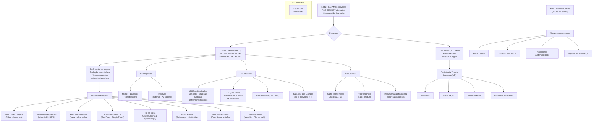

# Organização da Reunião — Fábrica Modelo

> **Reunião:** 30/06/2026 | 10:01-11:15 (74 min)
> **Participantes:** André Blanco, Maurilio Chiaretti, Fabio Takwara
> **Ausente:** Michel (mencionado — parceiro industrial, tecnologia de painéis de concreto)
> **Transcrição:** `Fabrica Modelo - Labiapa-Andre-meet.txt`
> **Preparado por:** Hermes Agent · Tecnologia Takwara

---

## 1. 📋 RESUMO EXECUTIVO

### Contexto
Reunião de alinhamento entre Fabio Takwara (pesquisador cidadão — bambu + PU Vegetal + IA), André Blanco (arquiteto, TEIA, ABNT) e Maurilio Chiaretti (arquiteto, sindicatos, habitação social) para discutir a aproximação de suas expertises em um projeto de industrialização da construção civil via edital FINEP Mais Inovação.

### O que ficou acordado

**Estratégia central:** Usar a **tecnologia de painéis arquitetônicos de concreto do Michel** (patenteada, já acreditada na Caixa/CDHU) como **porta de entrada do projeto FINEP**, por ser o ativo mais maduro e com contrapartida real. Dentro desse guarda-chuva, abrir linhas de P&D para redução do consumo de concreto/aço e incorporação de materiais alternativos (bambu, PU Vegetal, terra, resíduos agrícolas/plásticos).

**Posição de Fabio:** Não é fornecedor. É assessor técnico-científico. Entra com curadoria documental, fundamentação científica, proposals. Só remunerado se projeto aprovado.

### Dois caminhos discutidos

| Caminho | Descrição | Prós | Riscos |
|---------|-----------|------|--------|
| **A — Foco no Michel** | Projeto centrado nos painéis de concreto, com P&D para redução de materiais e incorporação de alternativas | Contrapartida real (Michel dispôs a bancar ~R$160k/casa protótipo), tecnologia já acreditada, mais rápido | Pode limitar escopo das inovações |
| **B — Fábrica Escola** | Projeto maior, multi-tecnologias (bambu, PU, terra, reciclados, concreto mínimo) | Escopo amplo, alinhado ao sonho do grupo | Mais complexo, contrapartida maior, mais atores |

**Decisão:** Caminho A como estratégia imediata, pavimentando o B depois. O projeto deve ser redigido de forma a abrir espaço para inovação em materiais sem comprometer o núcleo maduro.

### Próximo passo imediato
Fabio produz esboço/rascunho da proposta hoje. Grupo revisa via WhatsApp com áudios identificados (quem fala, sobre qual documento/item).

---

## 2. 🗺️ MAPA MENTAL — ESTRUTURA DO PROJETO



---

## 3. 🎯 TAREFAS E ATRIBUIÇÕES

| # | Tarefa | Responsável | Prazo | Status |
|---|--------|-------------|-------|--------|
| T01 | **Produzir rascunho da proposta/teaser** — documento de apresentação para parceiros institucionais | Fabio Takwara | 30/06 (hoje) | 🔄 Em andamento |
| T02 | **Enviar materiais complementares** — links, projetos, documentos de referência via WhatsApp | André Blanco | 30/06 | ⏳ A fazer |
| T03 | **Verificar situação financeira/contábil do Michel** — capacidade de contrapartida real, enquadramento FINEP | Maurilio Chiaretti | 04/07 (sex) | ⏳ Agendado |
| T04 | **Preparar versão do projeto para parceiros institucionais** — proposal teaser + carta-convite para ICTs e investidores | Fabio | 07/07 | ⏳ A fazer |
| T05 | **Mapear contatos universitários e potenciais investidores** — UFSCar, IPT, UNESP, São José dos Campos, Imperveg | André + Grupo | 07/07 | ⏳ A fazer |
| T06 | **Fechar carta de intenções com ICT** — obter modelo da universidade, adaptar, assinar | André + Fabio + ICT | 14/07 | ⏳ A fazer |
| T07 | **Enviar materiais de pesquisa/experiência** — Maurilio enviar projetos técnicos que tem | Maurilio Chiaretti | 07/07 | ⏳ A fazer |
| T08 | **Elaborar minuta de Acordo de Parceria** — entre empresas proponentes | Fabio (minuta) + Grupo (revisão) | 31/07 | ⏳ A fazer |
| T09 | **Levantar documentação financeira** — balanços, faturamento para comprovar contrapartida | Cada um (sua empresa) | 21/07 | ⏳ A fazer |
| T10 | **Definir arranjo de contrapartida** — quem entra com quanto, com base nas capacidades reais | Grupo + Investidores | 21/07 | ⏳ A fazer |
| T11 | **Escrever proposta completa FINEP** — integrando todos os insumos | Fabio (coord. redação) | 15/08 | ⏳ A fazer |
| T12 | **Revisão final e ajustes** — grupo, ICT, parceiros | Grupo | 15-31/08 | ⏳ A fazer |

### Telecomunicação
- **WhatsApp** para comunicação rápida e envio de materiais
- **Áudios devem ser identificados:** quem fala, sobre qual documento/item
- Fabio processa tudo via agentes e integra na proposta

---

## 4. 📐 DIRETRIZES DO GRUPO

### 4.1 Estratégia de posicionamento no projeto FINEP

1. **O projeto não é "anti-concreto"** — é um projeto de **inovação em industrialização da construção civil**, que tem no sistema de painéis Michel seu núcleo maduro, mas abre P&D para redução de impacto e novos materiais
2. **A abordagem subliminar** funciona melhor: colocar a pesquisa em bambu+PU e outros materiais como "linha de P&D para melhoria do sistema" — não como substituição radical
3. **Não dar destaque maior do que os parceiros (Michel) querem** — a inovação alternativa é apresentada como **agregação de valor**, não como crítica ao concreto

### 4.2 Critérios FINEP — o que já sabemos

| Requisito | Detalhe | Impacto |
|-----------|---------|---------|
| Valor mínimo | R$ 5 milhões | Projeto não pode ser menor |
| ICT obrigatório | Instituto de Ciência e Tecnologia parceiro | Sem ICT = desclassificado |
| Contrapartida | Exclusivamente financeira (não serviços) | Cada empresa entra com % do seu faturamento |
| Empresa proponente | Não pode ser contratada pelo projeto | Papel de Executor |
| Limite por empresa | Definido por capacidade financeira (faturamento - custos) | Empresa saudável = maior capacidade |
| Micro/Pequena | Faturamento até R$ 4,8M/ano → contrapartida 5% | Melhor enquadramento |
| Média | R$ 4,8M-10M → contrapartida 10% | |
| Grande | Acima → até 50% | |
| Arranjo em Rede | 3+ estados, ICT em cada um, contrapartida +R$16M | Descartado para agora |
| Resíduos Sólidos | Pontuação extra se alinhado à PNRS | **Vantagem competitiva** |

### 4.3 Atribuições de Papel

| Pessoa | Papel no Projeto | Função |
|--------|------------------|--------|
| **Michel** | Proponente principal / Empresa âncora | Tecnologia de painéis, contrapartida principal, prototipagem |
| **André Blanco** | Coordenação técnica / Articulação institucional | ABNT 6263, interface universidades, CDHU/Caixa |
| **Maurilio Chiaretti** | Articulação política / Sindical | Federação Nacional dos Arquitetos, interface movimentos sociais |
| **Fabio Takwara** | Assessoria técnico-científica / Curadoria | Organização documental, fundamentação científica, redação da proposta, IA |
| **Imperveg (Donizete)** | Parceiro tecnológico (fornecedor material) | PU Vegetal para testes e prototipagem |
| **ICT (a definir)** | Parceiro institucional / Pesquisa | Ensaios, validação, certificação, corpo técnico |

### 4.4 Regras de fronteira

- ✅ **Cada um com seu escopo** — sem sobreposição. A contribuição técnica de cada um é respeitada
- ✅ **Remuneração só após aprovação** — ninguém está sendo pago agora
- ✅ **Honestidade técnica** — TRLs reais, sem maquiagem de "concreto verde"
- ✅ **Comunicação por áudio identificado** — "Aqui é [nome], sobre o item X do documento Y..."
- ❌ **Não forçar tecnologias que não se encaixam** — bambu+PU entra onde faz sentido
- ❌ **Não usar codinomes internos** em documentos públicos do projeto

### 4.5 Próximos passos imediatos — CRONOGRAMA REVISADO

> ⚠️ **Nota do Fabio:** Prazo realista para envio aos parceiros institucionais é de **5 a 7 dias**.
> R$ 160k de contrapartida (Michel) é insuficiente para o teto mínimo de R$ 5M.
> **Precisamos de um grande investidor/âncora com capacidade de contrapartida real.**

```
FASE 1 — PREPARAÇÃO (30/06 a 07/07) ← 5-7 DIAS
├── HOJE (30/06)
│   ├── Fabio: produz rascunho da proposta ← ESTAMOS AQUI
│   ├── André: envia materiais complementares via WhatsApp
│   └── Grupo: revisa e comenta
│
├── ATÉ 04/07 (sex)
│   ├── Maurilio: conversa com Michel — levantar capacidade real
│   ├── Fabio: integra feedback, refina proposta
│   └── Grupo: alinha estratégia de contrapartida
│
└── ATÉ 07/07 (seg)
    ├── VERSÃO PARA PARCEIROS INSTITUCIONAIS ENVIADA
    ├── Documento de apresentação do projeto (proposal teaser)
    ├── Carta-convite para ICTs e potenciais investidores
    └── Definição de qual(is) ICT(s) abordar

FASE 2 — FECHAMENTO DE PARCERIAS (08/07 a 31/07)
├── ATÉ 14/07
│   ├── Carta de Intenções com ICT assinada
│   └── Manifestação de interesse de investidores
│
├── ATÉ 21/07
│   ├── Definição do arranjo de contrapartida
│   ├── Documentação financeira de todas as empresas
│   └── Minuta de Acordo de Parceria entre proponentes
│
└── ATÉ 31/07
    ├── Primeira versão completa da proposta
    └── Validação pelo grupo + ICT

FASE 3 — FECHAMENTO (01/08 a 31/08)
├── ATÉ 15/08
│   ├── Revisão técnica e jurídica
│   └── Ajustes finais com ICT e parceiros
│
├── 15-25/08
│   ├── Documentação completa (fiscal, técnica, anexos)
│   └── Pré-submissão (revisão de últimos detalhes)
│
└── 31/08 — SUBMISSÃO FINEP
```

### 4.6 ⚠️ O Problema da Contrapartida — Ponto Crítico

| Item | Valor | Observação |
|------|-------|------------|
| Teto mínimo FINEP | R$ 5.000.000,00 | Abaixo disso não submete |
| Contrapartida 5% (microempresa) | R$ 250.000,00 | Já é 56% maior que os R$ 160k do Michel |
| Contrapartida 10% (empresa média) | R$ 500.000,00 | |
| Contrapartida 20-50% (grande) | R$ 1.000.000-2.500.000,00 | |
| Prototipagem Michel (estimado) | ~R$ 160.000,00 | **Insuficiente isoladamente** |

**Possíveis soluções discutidas no grupo:**

| Alternativa | Viabilidade | Riscos |
|-------------|-------------|--------|
| **A — Uma empresa maior como proponente âncora** (ex: Imperveg, construtora, indústria) | Média — Imperveg pode entrar com contrapartida em material (mas FINEP exige financeira) | Perder autonomia técnica |
| **B — Consórcio de microempresas** (cada uma com sua contrapartida 5%) | Requer 3-5 empresas com R$ 4,8M faturamento cada | Complexidade de gestão |
| **C — Michel + outra(s) empresa(s) como co-proponentes** | A ver — Maurilio vai levantar na sexta | Depende da saúde financeira |
| **D — ICT como âncora** (universidade pública pode reduzir exigência de contrapartida?) | A verificar no edital | ICT sozinho não substitui empresa |
| **E — Investidor externo / patrono** (empresa de grande porte interessada no resultado) | Ideal — resolveria a contrapartida e o capital | Encontrar esse investidor é o desafio |

**Decisão:** A definir após Maurilio levantar a real capacidade do Michel (sex 04/07) e do grupo mapear potenciais investidores na rede de contatos.

---

## 5. 📄 DOCUMENTOS MENCIONADOS COMO PONTO DE PARTIDA

### Documentos que Fabio já produziu e estão disponíveis

| Documento | Localização | Status |
|-----------|-------------|--------|
| Pauta da Reunião | `Mentoria_Tecnologia_Takwara/PLANOS/PAUTA_REUNIAO_FABRICA_MODELO.md` | ✅ Commitado |
| Ficha André Blanco | `Analises-e-escrita-cientifica/` | ✅ Criada |
| Fichas científicas (17) — LEED, AQUA, Casa Azul, VERRA, Gold Standard, ACV, Impactos Cimento, SMGA, PU Vegetal, Bambu | `Analises-e-escrita-cientifica/docs/analises/` | ✅ Criadas |
| Extração de dados das fichas | `Mentoria_Tecnologia_Takwara/extracao_dados_fichas_cientificas.md` | ✅ Criado |
| Roteiro de Defesa (pronunciamento) | `~/Documents/roteiros/ROTEIRO_DEFESA_CONTRA_CONCRETO.md` | ✅ Criado (fora de git) |
| Repositório Fábrica Modelo | `github.com/takwaratec/fabrica-modelo` | ✅ Criado |
| Edital FINEP Mais Inovação | `fabrica-modelo/EDITAIS/` | ✅ Baixado |

### Documentos que André vai enviar (aguardando)

| Item | Descrição | Status |
|------|-----------|--------|
| Links de projetos de inovação | André mencionou "vários projetos" — vai mandar link | ⏳ Pendente |
| Informações complementares sobre a Texos | Patente, CDHU, Caixa, IPT | ⏳ Pendente |
| Contatos universidades | UFSCar, IPT, São José dos Campos, Inova/Unicamp | ⏳ Pendente |

### Documentos que Maurilio vai enviar (aguardando)

| Item | Descrição | Status |
|------|-----------|--------|
| Projetos técnicos | Experiência com sistema construtivo | ⏳ Pendente |
| Situação Michel | Capacidade de contrapartida, enquadramento FINEP | ⏳ Conversa agendada (sex) |

### Documentos a produzir

| # | Documento | Responsável | Prazo |
|---|-----------|-------------|-------|
| D01 | **Rascunho da proposta** — escopo, justificativa, metodologia, orçamento preliminar | Fabio | 30/06 |
| D02 | **Carta de Intenções ICT** — modelo da universidade parceira | André + ICT | Até 14/07 |
| D03 | **Minuta de Acordo de Parceria** — entre proponentes | Fabio (minuta) | Até 31/07 |
| D04 | **Proposta completa FINEP** — todos os anexos, documentos fiscais | Grupo | Até 15/08 |

### Links e referências mencionados na reunião

| Referência | Tipo | Relevância |
|------------|------|------------|
| **Imperveg (Donizete)** — PU Vegetal, fábrica em Aguaí/SP e Portugal | Parceiro tecnológico | PU para prototipagem, certificações, contato direto Fabio |
| **Sérgio Prado** — Patente Eco Fabri (reciclagem plástico + PU → tijolos, container) | Inventor | Possível parceria, Fabio tem contato |
| **UFSCar** — berço do PU de mamona (Prof. Cherrice), biodiesel, construção civil | ICT potencial | Peso acadêmico, PU Vegetal foi desenvolvido lá |
| **IPT** — curso engenharia madeira, Fábio tem contato | ICT potencial | Ensaios, certificação |
| **São José dos Campos** — Polo de Inovação + IPT + UNESP + incubadora | Ecossistema | André tem contato com diretor de inovação |
| **Inova/Unicamp (Campinas)** | ICT potencial | Proximidade geográfica |
| **Fumep (Piracicaba)** | ICT potencial | |
| **ABNT Comissão 6263** — André é membro | Normativa | Novas normas (plano diretor, infraestrutura verde) saindo agora |
| **Gisele Vilela (Embrapa)** — pó de rocha para agroecologia | Parceira | Resíduos de mineração como insumo construção |
| **Daniela Maciel (Embrapa Territorial)** — ferramentas de monitoramento | Parceira | MRV, georreferenciamento |
| **Ludmila (DF)** — arranjos institucionais, normalização | Articuladora | Fabio tem contato |
| **Prof. Basta** — estufas geodésicas | Parceiro | Aplicação bambu na agricultura |
| **Flor da Vida (Americana)** — cannabis para tijolos | Parceiro potencial | Maurilio já fez estudos |
| **Simão (Colômbia)** — técnica Bahareque (terra + bambu + mínimo cimento) | Referência técnica | 4 décadas de uso |
| **Universidad Tecnológica de Pereira (Colômbia)** — diploma em bambu | Referência acadêmica | Contato com Prof. Ximena |
| **Belgo Mineira** — pesquisa concreto verde (pozolana, escória) | Referência setorial | Por que a indústria do aço está investindo |
| **Série Técnica Takwara** (Zenodo DOI: 10.5281/zenodo.18827106) | Publicação | Embasa credibilidade científica |

---

> **Preparado por:** Hermes Agent · Tecnologia Takwara
> **Data:** 30/06/2026
> **Baseado na transcrição:** `Fabrica Modelo - Labiapa-Andre-meet.txt`
> **Arquivo:** `fabrica-modelo/docs/ORGANIZACAO_REUNIAO_3006.md`
