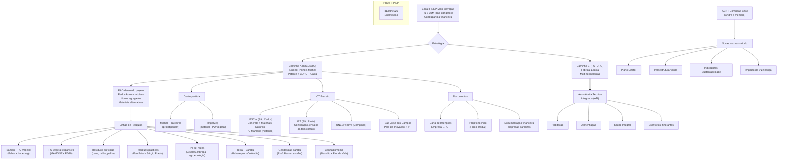

# Organização da Reunião — Fábrica Modelo

> **Reunião:** 30/06/2026 | 10:01-11:15 (74 min)
> **Participantes:** André Blanco, Maurilio Chiaretti, Fabio Takwara
> **Ausente:** Michel (mencionado — parceiro industrial, tecnologia de painéis de concreto)
> **Transcrição:** `Fabrica Modelo - Labiapa-Andre-meet.txt`
> **Preparado por:** Hermes Agent · Tecnologia Takwara

---

## 1. 📋 RESUMO EXECUTIVO

### Contexto
Reunião de alinhamento entre Fabio Takwara (pesquisador cidadão — bambu + PU Vegetal + IA), André Blanco (arquiteto, TEIA, ABNT) e Maurilio Chiaretti (arquiteto, sindicatos, habitação social) para discutir a aproximação de suas expertises em um projeto de industrialização da construção civil via edital FINEP Mais Inovação.

### O que ficou acordado

**Estratégia central:** Usar a **tecnologia de painéis arquitetônicos de concreto do Michel** (patenteada, já acreditada na Caixa/CDHU) como **porta de entrada do projeto FINEP**, por ser o ativo mais maduro e com contrapartida real. Dentro desse guarda-chuva, abrir linhas de P&D para redução do consumo de concreto/aço e incorporação de materiais alternativos (bambu, PU Vegetal, terra, resíduos agrícolas/plásticos).

**Posição de Fabio:** Não é fornecedor. É assessor técnico-científico. Entra com curadoria documental, fundamentação científica, proposals. Só remunerado se projeto aprovado.

### Dois caminhos discutidos

| Caminho | Descrição | Prós | Riscos |
|---------|-----------|------|--------|
| **A — Foco no Michel** | Projeto centrado nos painéis de concreto, com P&D para redução de materiais e incorporação de alternativas | Contrapartida real (Michel dispôs a bancar ~R$160k/casa protótipo), tecnologia já acreditada, mais rápido | Pode limitar escopo das inovações |
| **B — Fábrica Escola** | Projeto maior, multi-tecnologias (bambu, PU, terra, reciclados, concreto mínimo) | Escopo amplo, alinhado ao sonho do grupo | Mais complexo, contrapartida maior, mais atores |

**Decisão:** Caminho A como estratégia imediata, pavimentando o B depois. O projeto deve ser redigido de forma a abrir espaço para inovação em materiais sem comprometer o núcleo maduro.

### Próximo passo imediato
Fabio produz esboço/rascunho da proposta hoje. Grupo revisa via WhatsApp com áudios identificados (quem fala, sobre qual documento/item).

---

## 2. 🗺️ MAPA MENTAL — ESTRUTURA DO PROJETO



---

## 3. 🎯 TAREFAS E ATRIBUIÇÕES

| # | Tarefa | Responsável | Prazo | Status |
|---|--------|-------------|-------|--------|
| T01 | **Produzir rascunho da proposta** — esboço do projeto, organograma, frentes de trabalho | Fabio Takwara | 30/06 (hoje) | 🔄 Em andamento |
| T02 | **Enviar materiais complementares** — links, projetos, documentos de referência via WhatsApp | André Blanco | 30/06 | ⏳ A fazer |
| T03 | **Verificar situação financeira/contábil do Michel** — capacidade de contrapartida, enquadramento FINEP | Maurilio Chiaretti | Até 04/07 (sex) | ⏳ Agendado |
| T04 | **Mapear todos os contatos universitários** — UFSCar, IPT, UNESP, São José dos Campos — perfil, capacidade, interesse | André Blanco | Até 07/07 | ⏳ A fazer |
| T05 | **Fechar carta de intenções com ICT** — obter modelo da universidade, adaptar, assinar | André + Fabio | Até 14/07 | ⏳ A fazer |
| T06 | **Enviar materiais de pesquisa/experiência** — Maurilio enviar projetos técnicos que tem (sem necessidade de publicação formal) | Maurilio Chiaretti | Esta semana | ⏳ A fazer |
| T07 | **Elaborar documento de parceria** — Termo de Cooperação entre as empresas proponentes | Fabio (minuta) + Grupo (revisão) | Até 21/07 | ⏳ A fazer |
| T08 | **Levantar documentação financeira** — balanços, faturamento das empresas para contrapartida | Cada um (sua empresa) | Até 21/07 | ⏳ A fazer |
| T09 | **Definir valor do projeto** — com base na capacidade de contrapartida real do grupo | Grupo (decisão conjunta) | Até 21/07 | ⏳ A fazer |
| T10 | **Escrever proposta completa FINEP** — integrando todos os insumos | Fabio (coord. redação) | Até 15/08 | ⏳ A fazer |
| T11 | **Revisão final e ajustes** — grupo + parceiros | Grupo | 15-31/08 | ⏳ A fazer |

### Telecomunicação
- **WhatsApp** para comunicação rápida e envio de materiais
- **Áudios devem ser identificados:** quem fala, sobre qual documento/item
- Fabio processa tudo via agentes e integra na proposta

---

## 4. 📐 DIRETRIZES DO GRUPO

### 4.1 Estratégia de posicionamento no projeto FINEP

1. **O projeto não é "anti-concreto"** — é um projeto de **inovação em industrialização da construção civil**, que tem no sistema de painéis Michel seu núcleo maduro, mas abre P&D para redução de impacto e novos materiais
2. **A abordagem subliminar** funciona melhor: colocar a pesquisa em bambu+PU e outros materiais como "linha de P&D para melhoria do sistema" — não como substituição radical
3. **Não dar destaque maior do que os parceiros (Michel) querem** — a inovação alternativa é apresentada como **agregação de valor**, não como crítica ao concreto

### 4.2 Critérios FINEP — o que já sabemos

| Requisito | Detalhe | Impacto |
|-----------|---------|---------|
| Valor mínimo | R$ 5 milhões | Projeto não pode ser menor |
| ICT obrigatório | Instituto de Ciência e Tecnologia parceiro | Sem ICT = desclassificado |
| Contrapartida | Exclusivamente financeira (não serviços) | Cada empresa entra com % do seu faturamento |
| Empresa proponente | Não pode ser contratada pelo projeto | Papel de Executor |
| Limite por empresa | Definido por capacidade financeira (faturamento - custos) | Empresa saudável = maior capacidade |
| Micro/Pequena | Faturamento até R$ 4,8M/ano → contrapartida 5% | Melhor enquadramento |
| Média | R$ 4,8M-10M → contrapartida 10% | |
| Grande | Acima → até 50% | |
| Arranjo em Rede | 3+ estados, ICT em cada um, contrapartida +R$16M | Descartado para agora |
| Resíduos Sólidos | Pontuação extra se alinhado à PNRS | **Vantagem competitiva** |

### 4.3 Atribuições de Papel

| Pessoa | Papel no Projeto | Função |
|--------|------------------|--------|
| **Michel** | Proponente principal / Empresa âncora | Tecnologia de painéis, contrapartida principal, prototipagem |
| **André Blanco** | Coordenação técnica / Articulação institucional | ABNT 6263, interface universidades, CDHU/Caixa |
| **Maurilio Chiaretti** | Articulação política / Sindical | Federação Nacional dos Arquitetos, interface movimentos sociais |
| **Fabio Takwara** | Assessoria técnico-científica / Curadoria | Organização documental, fundamentação científica, redação da proposta, IA |
| **Imperveg (Donizete)** | Parceiro tecnológico (fornecedor material) | PU Vegetal para testes e prototipagem |
| **ICT (a definir)** | Parceiro institucional / Pesquisa | Ensaios, validação, certificação, corpo técnico |

### 4.4 Regras de fronteira

- ✅ **Cada um com seu escopo** — sem sobreposição. A contribuição técnica de cada um é respeitada
- ✅ **Remuneração só após aprovação** — ninguém está sendo pago agora
- ✅ **Honestidade técnica** — TRLs reais, sem maquiagem de "concreto verde"
- ✅ **Comunicação por áudio identificado** — "Aqui é [nome], sobre o item X do documento Y..."
- ❌ **Não forçar tecnologias que não se encaixam** — bambu+PU entra onde faz sentido
- ❌ **Não usar codinomes internos** em documentos públicos do projeto

### 4.5 Próximos passos imediatos

```
HOJE (30/06)
├── Fabio: produz rascunho da proposta ← ESTAMOS AQUI
├── André: envia materiais complementares via WhatsApp
└── Grupo: revisa e comenta

NESTA SEMANA (até 04/07)
├── Maurilio: conversa com Michel sobre contrapartida
├── André: contatos universidades (UFSCar, IPT, SJC)
└── Fabio: integra feedback e refina proposta

ATÉ 14/07
├── Definição do ICT parceiro
├── Carta de Intenções assinada
└── Esboço do projeto validado pelo grupo

ATÉ 31/07
├── Documentação financeira de todas as empresas
├── Minuta de parceria / acordo entre proponentes
└── Primeira versão completa da proposta

ATÉ 15/08
├── Revisão final
├── Ajustes com ICT
└── Preparação para submissão

31/08 — SUBMISSÃO FINEP
```

---

## 5. 📄 DOCUMENTOS MENCIONADOS COMO PONTO DE PARTIDA

### Documentos que Fabio já produziu e estão disponíveis

| Documento | Localização | Status |
|-----------|-------------|--------|
| Pauta da Reunião | `Mentoria_Tecnologia_Takwara/PLANOS/PAUTA_REUNIAO_FABRICA_MODELO.md` | ✅ Commitado |
| Ficha André Blanco | `Analises-e-escrita-cientifica/` | ✅ Criada |
| Fichas científicas (17) — LEED, AQUA, Casa Azul, VERRA, Gold Standard, ACV, Impactos Cimento, SMGA, PU Vegetal, Bambu | `Analises-e-escrita-cientifica/docs/analises/` | ✅ Criadas |
| Extração de dados das fichas | `Mentoria_Tecnologia_Takwara/extracao_dados_fichas_cientificas.md` | ✅ Criado |
| Roteiro de Defesa (pronunciamento) | `~/Documents/roteiros/ROTEIRO_DEFESA_CONTRA_CONCRETO.md` | ✅ Criado (fora de git) |
| Repositório Fábrica Modelo | `github.com/takwaratec/fabrica-modelo` | ✅ Criado |
| Edital FINEP Mais Inovação | `fabrica-modelo/EDITAIS/` | ✅ Baixado |

### Documentos que André vai enviar (aguardando)

| Item | Descrição | Status |
|------|-----------|--------|
| Links de projetos de inovação | André mencionou "vários projetos" — vai mandar link | ⏳ Pendente |
| Informações complementares sobre a Texos | Patente, CDHU, Caixa, IPT | ⏳ Pendente |
| Contatos universidades | UFSCar, IPT, São José dos Campos, Inova/Unicamp | ⏳ Pendente |

### Documentos que Maurilio vai enviar (aguardando)

| Item | Descrição | Status |
|------|-----------|--------|
| Projetos técnicos | Experiência com sistema construtivo | ⏳ Pendente |
| Situação Michel | Capacidade de contrapartida, enquadramento FINEP | ⏳ Conversa agendada (sex) |

### Documentos a produzir

| # | Documento | Responsável | Prazo |
|---|-----------|-------------|-------|
| D01 | **Rascunho da proposta** — escopo, justificativa, metodologia, orçamento preliminar | Fabio | 30/06 |
| D02 | **Carta de Intenções ICT** — modelo da universidade parceira | André + ICT | Até 14/07 |
| D03 | **Minuta de Acordo de Parceria** — entre proponentes | Fabio (minuta) | Até 31/07 |
| D04 | **Proposta completa FINEP** — todos os anexos, documentos fiscais | Grupo | Até 15/08 |

### Links e referências mencionados na reunião

| Referência | Tipo | Relevância |
|------------|------|------------|
| **Imperveg (Donizete)** — PU Vegetal, fábrica em Aguaí/SP e Portugal | Parceiro tecnológico | PU para prototipagem, certificações, contato direto Fabio |
| **Sérgio Prado** — Patente Eco Fabri (reciclagem plástico + PU → tijolos, container) | Inventor | Possível parceria, Fabio tem contato |
| **UFSCar** — berço do PU de mamona (Prof. Cherrice), biodiesel, construção civil | ICT potencial | Peso acadêmico, PU Vegetal foi desenvolvido lá |
| **IPT** — curso engenharia madeira, Fábio tem contato | ICT potencial | Ensaios, certificação |
| **São José dos Campos** — Polo de Inovação + IPT + UNESP + incubadora | Ecossistema | André tem contato com diretor de inovação |
| **Inova/Unicamp (Campinas)** | ICT potencial | Proximidade geográfica |
| **Fumep (Piracicaba)** | ICT potencial | |
| **ABNT Comissão 6263** — André é membro | Normativa | Novas normas (plano diretor, infraestrutura verde) saindo agora |
| **Gisele Vilela (Embrapa)** — pó de rocha para agroecologia | Parceira | Resíduos de mineração como insumo construção |
| **Daniela Maciel (Embrapa Territorial)** — ferramentas de monitoramento | Parceira | MRV, georreferenciamento |
| **Ludmila (DF)** — arranjos institucionais, normalização | Articuladora | Fabio tem contato |
| **Prof. Basta** — estufas geodésicas | Parceiro | Aplicação bambu na agricultura |
| **Flor da Vida (Americana)** — cannabis para tijolos | Parceiro potencial | Maurilio já fez estudos |
| **Simão (Colômbia)** — técnica Bahareque (terra + bambu + mínimo cimento) | Referência técnica | 4 décadas de uso |
| **Universidad Tecnológica de Pereira (Colômbia)** — diploma em bambu | Referência acadêmica | Contato com Prof. Ximena |
| **Belgo Mineira** — pesquisa concreto verde (pozolana, escória) | Referência setorial | Por que a indústria do aço está investindo |
| **Série Técnica Takwara** (Zenodo DOI: 10.5281/zenodo.18827106) | Publicação | Embasa credibilidade científica |

---

> **Preparado por:** Hermes Agent · Tecnologia Takwara
> **Data:** 30/06/2026
> **Baseado na transcrição:** `Fabrica Modelo - Labiapa-Andre-meet.txt`
> **Arquivo:** `fabrica-modelo/docs/ORGANIZACAO_REUNIAO_3006.md`
