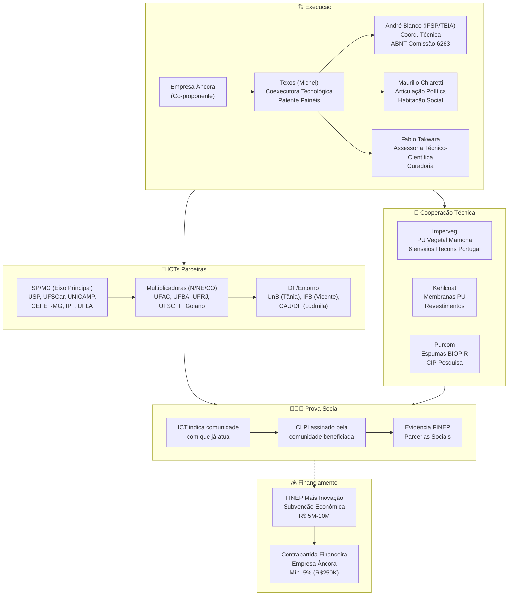
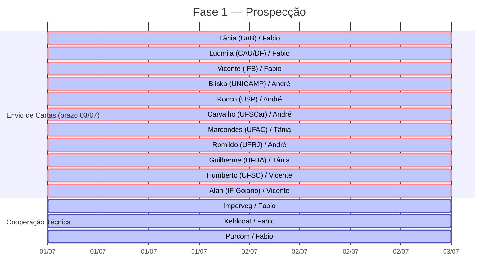
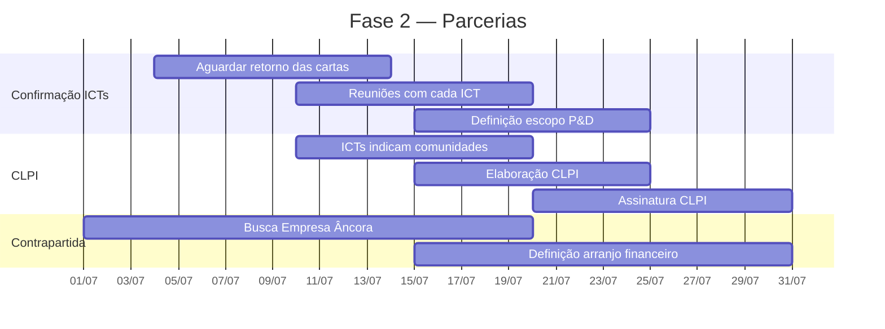
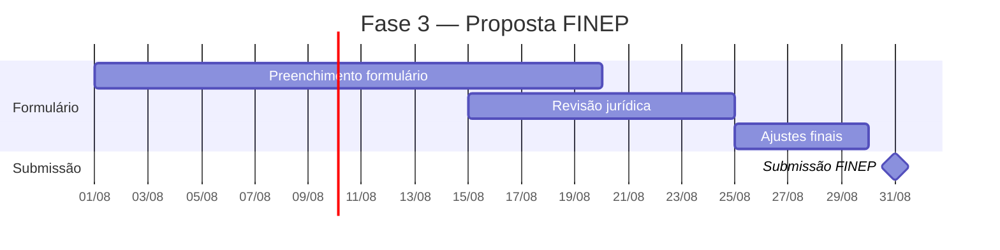

# 🏭 Projeto Fábrica Modelo — Vista Geral

> Documento de visão geral do projeto. Contém o fluxograma completo, cronograma, estrutura de governança e etapas — sem precisar ler o README inteiro.
> Mantido pelo Hermes Agent · Atualizado em 01/07/2026

---

## 1. 🧭 Mapa do Projeto (Mermaid)



---

## 2. 📅 Cronograma - Marco Zero (Julho 2026)

### Fase 1 — Prospecção e Convites (Prazo: 03/07)



### Fase 2 — Fechamento de Parcerias (Julho)



### Fase 3 — Escrita da Proposta (Agosto)



---

## 3. 🏗️ Estrutura de Governança

```
┌─────────────────────────────────────────────────────────────┐
│                    GRUPO EXECUTOR                           │
│  André Blanco · Maurilio Chiaretti · Michel (Texos)         │
│  Fabio Takwara (Assessoria)                                 │
├─────────────────────────────────────────────────────────────┤
│                                                             │
│  ┌──────────────┐  ┌──────────────┐  ┌──────────────────┐  │
│  │ ICTs SP/MG   │  │ Multiplicad. │  │ Coop. Técnica    │  │
│  │ (P&D, Certif)│  │ (Difusão,    │  │ (Insumos,        │  │
│  │              │  │  Regionaliz.)│  │  Laboratórios)   │  │
│  └──────────────┘  └──────────────┘  └──────────────────┘  │
│                                                             │
│  ┌──────────────────────────────────────────────────────┐   │
│  │           PROVA SOCIAL (CLPI)                        │   │
│  │  Comunidades indicadas pelas ICTs → CLPI assinado    │   │
│  └──────────────────────────────────────────────────────┘   │
│                                                             │
└─────────────────────────────────────────────────────────────┘
```

---

## 4. 👥 Quadro de Pessoas

### Membros Ativos (8)

| Membro | Instituição | Papel |
|--------|-------------|-------|
| André Blanco | IFSP / TEIA | Coord. Técnica, articulação ICT |
| Maurilio Chiaretti | FNA | Articulação Política, HIS |
| Michel (Texos) | Texos | Proponente candidato, painéis |
| Fabio Takwara | Ecolaborativa | Assessoria, curadoria |
| Marcos Paron | IFSP | Coord. ECOSALA, biochar |
| Daniela Maciel | Embrapa | Métricas de impacto social |
| Gisele Vilela | Embrapa | Remineralizadores |
| Vicente Virgolino | IFB | Forno ecológico, bambu |

### Prospecção (21 Prospects)

| Status | Qtde | Quem |
|--------|:----:|------|
| 📄 Carta pronta | 14 | Tânia, Ludmila, Vicente, Bliska, Rocco, Carvalho, Marcondes, Romildo, Guilherme, Humberto, Alan, Imperveg, Kehl, Purcom |
| 🔍 Em prospecção | 2 | Mendes (UFLA), Fiorelli (USP) |
| 🔄 Contato inicial | 2 | Joaquim (MST), Murilo (Terra Viva) |
| ⏳ Dados pendentes | 4 | C1-C4 ECOSALA |

---

## 5. 📋 Documentos Produzidos

### Cartas-Convite (14)

| # | Destinatário | Emissário |
|---|-------------|-----------|
| 1 | Tânia Cruz (UnB) | Fabio Takwara |
| 2 | Ludmila Correia (CAU/DF) | Fabio Takwara |
| 3 | Vicente Virgolino (IFB) | Fabio Takwara |
| 4 | Antonio Bliska Jr. (UNICAMP) | André Blanco |
| 5 | Rocco Lahr (USP EESC) | André Blanco |
| 6 | A.J.F. Carvalho (UFSCar) | André Blanco |
| 7 | Marcondes L. Costa (UFAC) | Tânia Cruz |
| 8 | Romildo Toledo Filho (UFRJ/COPPE) | André Blanco |
| 9 | Guilherme O. Silva (UFBA) | Tânia Cruz |
| 10 | Humberto C. Furtado (UFSC) | Vicente Virgolino |
| 11 | Alan P. Oliveira (IF Goiano) | Vicente Virgolino |
| 12 | Imperveg (Donizeti) | Fabio Takwara |
| 13 | Kehlcoat (Kehl Polímeros) | Fabio Takwara |
| 14 | Purcom Química | Fabio Takwara |

### Acervo — Fichas no Repositório Científico

| Categoria | Quantidade |
|-----------|:----------:|
| Perfis de pesquisadores | 15 |
| Fichas Imperveg | 21 |
| Fichas técnicas (Kehl, Purcom, Holambra, etc.) | 8 |
| SCI (Regência Científica MQTF) | 30 |
| FICHA (Credenciais + Produção + Bibliografia) | 31 |
| LAB (Ensaios Laboratoriais BNDES) | 6 |
| Resenhas (Bliska, Naccache, ITecons) | 9 |
| **Total aproximado** | **~120** |

---

## 6. 🔗 Links Rápidos

| Recurso | Link |
|---------|------|
| README do Projeto | [github.com/takwaratec/fabrica-modelo](https://github.com/takwaratec/fabrica-modelo) |
| Acervo Científico | [github.com/takwaratec/Analises-e-escrita-cientifica](https://github.com/takwaratec/Analises-e-escrita-cientifica) |
| Índice no Acervo | [Index Fábrica Modelo](https://github.com/takwaratec/Analises-e-escrita-cientifica/blob/main/docs/analises/fabrica-modelo/index.md) |
| Formulário Espelho FINEP | [`docs/editais/formulario-espelho-finep.md`](docs/editais/formulario-espelho-finep.md) |
| Modelo de CLPI | [`docs/editais/modelo-clpi.md`](docs/editais/modelo-clpi.md) |
| Regras Fornecedores | [`docs/editais/regras-participacao-fornecedores.md`](docs/editais/regras-participacao-fornecedores.md) |
| Acordo Cooperação Técnica | [`docs/editais/modelo-acordo-cooperacao-tecnica.md`](docs/editais/modelo-acordo-cooperacao-tecnica.md) |
| Documento Mestre (Mentoria) | [FRENTES_DE_TRABALHO.md](https://github.com/takwaratec/Mentoria_Tecnologia_Takwara/blob/main/FRENTES_DE_TRABALHO.md) |

---

## 7. 📌 Regras de Ouro

1. **Carta redigida ≠ carta enviada** — só atualiza para ✅ após envio com Cc para Fabio
2. **Fornecedor ≠ proponente** — cooperação técnica sem repasse financeiro
3. **Prova social** — ICT indica a comunidade, não o Grupo Executor
4. **CLPI** — consentimento assinado pela comunidade antes da intervenção
5. **Prazo FINEP** — submissão até **31/08/2026**
6. **Prazo cartas** — envio até **03/07/2026**

---

*Documento mantido pelo Hermes Agent · Tecnologia Takwara · 01/07/2026*
