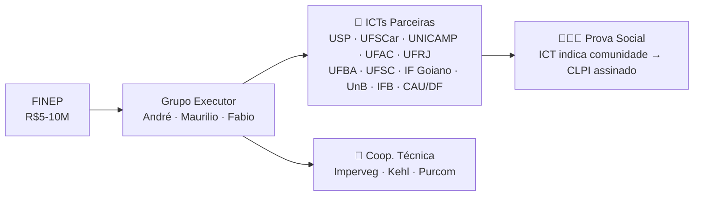

# 🏭 Projeto Fábrica Modelo — Vista Geral

> Visão geral do projeto em um só lugar. Diagramas e tabelas, sem o texto longo do README.
> Atualizado em 01/07/2026

---

## 🧭 Fluxo do Projeto

---

## 👥 Pessoas

### Membros Ativos

| Membro | Instituição | Papel |
|--------|-------------|-------|
| André Blanco | IFSP / TEIA | Coord. Técnica |
| Maurilio Chiaretti | FNA | Articulação Política |
| Fabio Takwara | Ecolaborativa | Assessoria |
| Marcos Paron | IFSP | ECOSALA |
| Daniela Maciel | Embrapa | Impacto Social |
| Gisele Vilela | Embrapa | Remineralizadores |
| Vicente Virgolino | IFB | Tratamento Bambu |

**Proponente candidato:** Texos (Michel) — tecnologia de painéis, capital insuficiente para o teto mínimo FINEP, busca associação com empresa âncora.

### Prospecção (20 prospects)

| Status | Qtde | Quem |
|--------|:----:|------|
| 📄 Carta pronta | 14 | Tânia, Ludmila, Vicente, Bliska, Rocco, Carvalho, Marcondes, Romildo, Guilherme, Humberto, Alan, Imperveg, Kehl, Purcom |
| ⏳ Dados pendentes | 5 | IPT (email), C1-C4 (CPF/LinkedIn) |
| 🔍 Em prospecção | 2 | Mendes (UFLA), Fiorelli (USP) |

---

## 📋 Cartas-Convite (14)

| # | Destinatário | Emissário | Prazo |
|---|-------------|-----------|:-----:|
| 1 | Tânia Cruz (UnB) | Fabio Takwara | 03/07 |
| 2 | Ludmila Correia (CAU/DF) | Fabio Takwara | 03/07 |
| 3 | Vicente Virgolino (IFB) | Fabio Takwara | 03/07 |
| 4 | Antonio Bliska Jr. (UNICAMP) | André Blanco | 03/07 |
| 5 | Rocco Lahr (USP EESC) | André Blanco | 03/07 |
| 6 | A.J.F. Carvalho (UFSCar) | André Blanco | 03/07 |
| 7 | Marcondes L. Costa (UFAC) | Tânia Cruz | 03/07 |
| 8 | Romildo Toledo Filho (UFRJ) | André Blanco | 03/07 |
| 9 | Guilherme O. Silva (UFBA) | Tânia Cruz | 03/07 |
| 10 | Humberto C. Furtado (UFSC) | Vicente Virgolino | 03/07 |
| 11 | Alan P. Oliveira (IF Goiano) | Vicente Virgolino | 03/07 |
| 12 | Imperveg (Donizeti) | Fabio Takwara | 03/07 |
| 13 | Kehlcoat (Kehl Polímeros) | Fabio Takwara | 03/07 |
| 14 | Purcom Química | Fabio Takwara | 03/07 |

---

## 📌 Regras de Ouro

1. **Carta redigida ≠ carta enviada** — status só vai para ✅ quando o emissário enviar com Cc para Fabio
2. **Fornecedor ≠ proponente** — cooperação técnica sem repasse financeiro (Imperveg, Kehl, Purcom)
3. **Prova social** — a ICT indica a comunidade onde atua, não o Grupo Executor
4. **CLPI** — consentimento assinado pela comunidade antes de qualquer intervenção
5. **Prazo FINEP** — submissão em **31/08/2026**

---

## 🔗 Links

| Recurso | Link |
|---------|------|
| README do Projeto | [github.com/takwaratec/fabrica-modelo](https://github.com/takwaratec/fabrica-modelo) |
| Acervo Científico | [github.com/takwaratec/Analises-e-escrita-cientifica](https://github.com/takwaratec/Analises-e-escrita-cientifica) |
| Índice no Acervo | [Index](https://github.com/takwaratec/Analises-e-escrita-cientifica/blob/main/docs/analises/fabrica-modelo/index.md) |
| Modelo de CLPI | [`docs/editais/modelo-clpi.md`](docs/editais/modelo-clpi.md) |
| Acordo Cooperação Técnica | [`docs/editais/modelo-acordo-cooperacao-tecnica.md`](docs/editais/modelo-acordo-cooperacao-tecnica.md) |

---

*Tecnologia Takwara · 01/07/2026*
