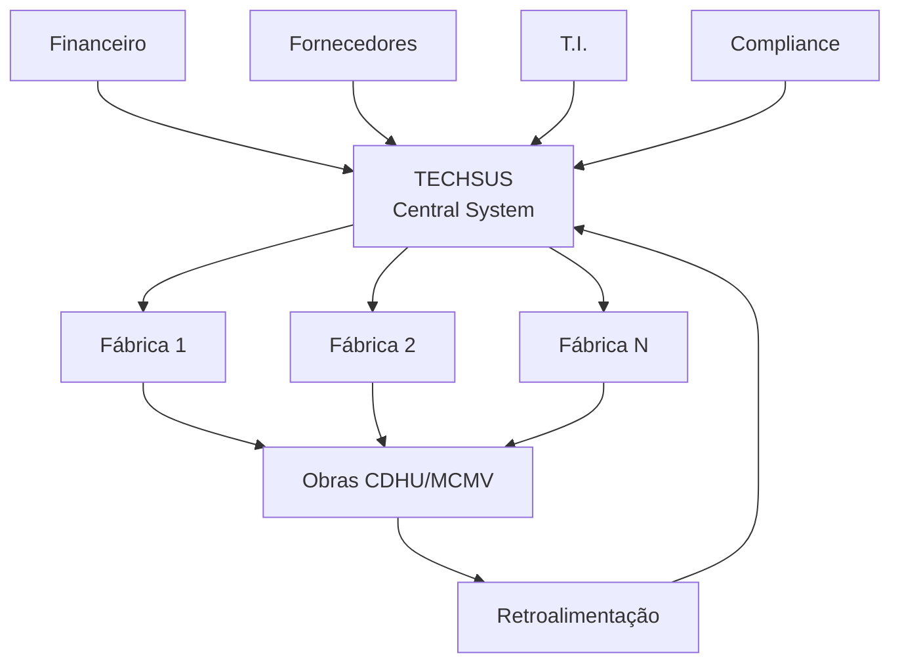

# Ficha Técnica: Sistema Construtivo Industrializado Faleiros-Techsus

> Caracterização completa do sistema, patentes, ensaios, certificações e dados para a proposta FINEP. Consolidado das duas fontes documentais.

---

## 1. Identificação do Sistema

| Campo | Dado | Fonte |
|-------|------|-------|
| **Nome** | Sistema Construtivo Faleiros-Techsus | Proposta Técnica |
| **Tipo** | Painéis nervurados pré-fabricados de concreto armado | Proposta Técnica p.8 |
| **Origem** | Evolução do Sistema Brasitherm (DPB) | Proposta Técnica p.8 |
| **Titular** | Techsus / Faleiros | Apresentação |
| **Fundador** | Michel Zeenni — 40+ anos em cálculo estrutural e construção civil | Apresentação p.3 |
| **Homologações** | ✅ CDHU (Offsite 001/2024), ✅ Caixa Econômica Federal, ✅ SINAT | Apresentação p.11 |
| **DATec** | Nº 024-B — Documento de Avaliação Técnica IPT (validade out/2020) | Proposta Técnica p.62-63 |
| **Patentes** | Requeridas/concedidas no Brasil, EUA e China | Apresentação p.10-11 |
| **TRL** | 7 — Sistema validado em ambiente operacional | Relatório Executivo |
| **Tipologias** | HHU-TI (casa térrea isolada) + HVM (prédio 4 andares) | Proposta Técnica p.42 |

---

## 2. Especificações Técnicas

### 2.1. Painéis de Parede

| Parâmetro | Valor |
|-----------|-------|
| **Espessura total** | 140 mm |
| **Composição** | Duas placas de concreto armado de 42 mm cada, afastadas 56 mm (câmara de ar) |
| **Função** | Estruturais, nervurados, autoportantes |
| **Altura** | Conforme pé-direito do projeto |
| **Comprimento** | Variável conforme projeto e capacidade de carga dos equipamentos |
| **Largura típica** | 160 mm (referência) |
| **Peso** | Peças mais leves que alvenaria convencional (painéis duplos ocos) |
| **Acabamento** | Face perfeitamente acabada — dispensa emboço e reboco |

### 2.2. Lajes

| Parâmetro | Valor |
|-----------|-------|
| **Tipo** | Maciças, pré-fabricadas de concreto armado |
| **Ligação com paredes** | Preenchimento simultâneo com graute das juntas entre panos de laje e rebaixo no topo do painel |

### 2.3. Fundação

| Tipo | Descrição |
|------|-----------|
| **Radier** | Plataforma de concreto com pontos hidráulicos e elétricos demarcados |
| **Alternativa** | Viga baldrame |

### 2.4. Concreto

| Parâmetro | Valor |
|-----------|-------|
| **Resistência mínima à desforma** | 8 MPa |
| **Cura** | 48 horas com aspersão de água |
| **Tipo** | Concreto armado convencional (objeto de P&D para substituições) |

---

## 3. Processo Produtivo

### 3.1. Fluxo de Fabricação (Sistema Carrossel)

### 3.2. Formas de Produção

| Forma | Descrição |
|-------|-----------|
| **Duro × Duro** | Painéis com duas faces acabadas |
| **Duro × Mole** | Forma tradicional com uma face moldada contra molde |

### 3.3. Logística

| Etapa | Detalhe |
|-------|---------|
| **Transporte** | Carretas especiais para peças pré-fabricadas |
| **Içamento** | Gruas ou guindastes |
| **Escoramento** | Escoras de aço metálicas |
| **Montagem** | Painéis apoiados sobre radier/viga baldrame. Arranques posicionados desde a fundação |
| **Grauteamento** | Ligações laterais + nervuras intermediárias + cinta inferior |

### 3.4. Prazos

| Etapa | Prazo |
|-------|-------|
| **Fabricação em fábrica** | Conforme escala (sistema carrossel) |
| **Montagem em obra (casa térrea)** | Dias (não semanas) |
| **Ciclo completo** | Redução de 70%+ vs. alvenaria convencional |

---

## 4. Ensaios e Certificações

### 4.1. Ensaios IPT Realizados

| Ensaio | Relatório IPT | Ano | Resultado |
|--------|:-------------:|:---:|-----------|
| **Acústica** | 980.629-203 | 2008 | Atende norma de desempenho |
| **Durabilidade** | 982.659-203 | 2008 | Atende VUP de 50 anos |
| **Conforto Térmico** | 107.880-205 e 107.881-205 | 2008 | Atende normas vigentes |
| **Desempenho do Sistema** | 107.938-205 | 2008 | Sistema aprovado |
| **Resistência ao Fogo** | 986.623-203 | — | **60 minutos** com carga vertical de 77 kN/m |
| **Estanqueidade** | — | — | Teste aprovado |

### 4.2. Sistema Produtivo — Controles de Qualidade

| Etapa | Controle |
|-------|----------|
| Concreto | Resistência mínima 8 MPa na desforma |
| Geometria | Tolerância milimétrica (~1 mm) — encaixe exato |
| Cura | Aspersão controlada por 48h |
| Transporte | Carretas especiais com proteção |
| Montagem | Escoramento metálico, prumo e nível |

### 4.3. DATec Nº 024-B

| Campo | Dado |
|-------|------|
| **Órgão emissor** | IPT — Instituto de Pesquisas Tecnológicas do Estado de SP |
| **Produto avaliado** | Sistema de paredes DPB de painéis nervurados pré-fabricados de concreto armado |
| **Proponente original** | DPB (Domus Populi Brasitherm) Soluções Tecnológicas para Construção Civil S.A. |
| **Validade** | Outubro de 2020 (a renovar) |
| **Edificações** | Habitacionais de até 5 pavimentos |

---

## 5. Dados de Mercado e Contexto

| Indicador | Valor | Fonte |
|-----------|-------|-------|
| Mercado global da construção (2023) | ~US$ 10,54 TRI | Grand View Research |
| Déficit habitacional Brasil (2022) | **6.215.313** domicílios (8,3%) | FJP |
| Maiores déficits | SP (1,2M), MG (556 mil) | FJP |
| Participação construção no PIB global | ~10% | Statista |
| Consumo de matéria-prima | 3 bi toneladas/ano (50% do aço mundial) | IBISWorld |
| Resíduos construção/demolição (EUA) | 40% dos resíduos sólidos | EPA |

---

## 6. Tipologias Habitacionais

### 6.1. HHU-TI — Casa Térrea Isolada

| Parâmetro | Valor |
|-----------|-------|
| **Área útil** | 41,85 m² |
| **Área construída** | 47,97 m² |
| **Pavimentos** | 1 (térreo) |
| **Status** | Protótipo construído e aprovado no Chamamento CDHU 001/2024 |

### 6.2. HVM — Prédio 4 Andares

| Parâmetro | Valor |
|-----------|-------|
| **Área construída térreo** | 222,94 m² |
| **Área total construída** | 891,76 m² |
| **Apartamento modelo** | 43,37 m² úteis / 49,23 m² construídos |
| **Status** | Em processo de homologação CDHU |

---

## 7. Modelo de Negócio Techsus

| Componente | Descrição |
|------------|-----------|
| **Modelo** | Gestão de redes de fábricas integradas de forma matricial |
| **Tecnologia 4.0** | Automação, BIM, modelagem da informação |
| **Alinhamento ESG** | ODS — Objetivos de Desenvolvimento Sustentável |
| **Diferencial** | Atende grande demanda com produtos competitivos e diferenciados tecnologicamente |
| **Vantagem logística** | Carretas dedicadas, montagem mecanizada |

---

## 8. Referências

| Documento | Localização |
|-----------|-------------|
| Proposta Técnica — CDHU Offsite 001/2024 (83p, extração texto) | `docs/editais/proposta-tecnica-techsus-faleiros-cdhu-2024.md` |
| Apresentação Techsus — dez/2025 (42 slides, extração texto) | `docs/materiais-andre/techsus_apresentacion_dez2025.md` |
| Faleiros_Techsus_FINEP_Strategy.pdf (10p, imagem) | `TRIAGEM BrUTA/` |
| Rascunho da Proposta FINEP (Cavichiolli) | `docs/editais/rascunho-proposta-finep-cavichiolli.md` |
| ATA Reunião 07/07/2026 | `docs/pesquisas/pesquisas-ict/2026-07-07_REUNIAO_FABRICA_MODELO_FINEP.md` |

---

> *Ficha elaborada conforme Protocolo Cavichiolli adaptado para caracterização de sistema construtivo. Dados extraídos da Proposta Técnica CDHU (83p) e Apresentação Techsus (42 slides).*
