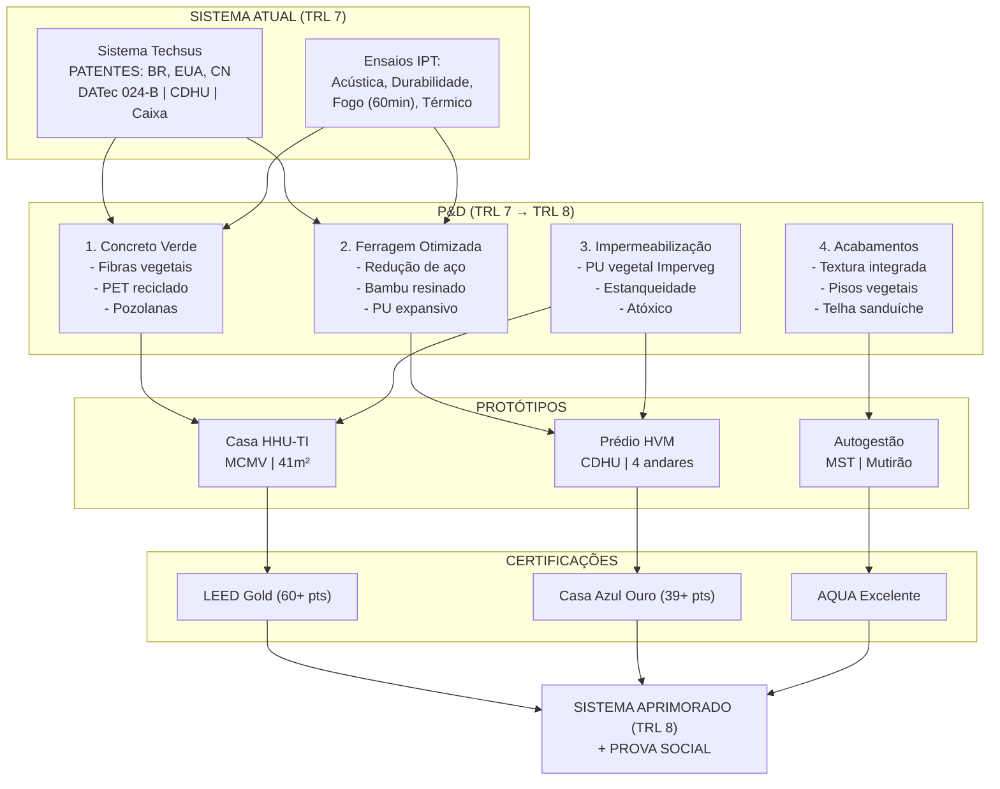

# Rascunho Base da Proposta — FINEP Subvenção Econômica

> Documento de trabalho para alimentar o formulário FINEP. Adaptação do Protocolo Cavichiolli (8 seções) para contexto de projeto de inovação. Cruzamento dos dados do Sistema Techsus, demandas de Michel, ensaios IPT e frentes de P&D.

---

## 1. Identificação do Projeto e Contexto

| Campo | Dado |
|-------|------|
| **Título** | Aprimoramento do Sistema Construtivo Industrializado Faleiros-Techsus com Inserção de Materiais Sustentáveis, Redução de Carbono e Prototipagem Habitacional |
| **Edital** | FINEP Mais Inovação Brasil — Rodada 2 — Economia Circular e Cidades Sustentáveis |
| **Linha Temática** | Economia Circular (Linha 1) / Cidades Sustentáveis |
| **Formato** | Arranjo em Rede (1 proponente + ≥2 coexecutoras + ≥1 ICT) |
| **Valor solicitado** | R$ 5.000.000,00 (mínimo) |
| **Contrapartida** | 5% (R$ 250.000,00) — empresa de pequeno porte |
| **ICT(s)** | Mínimo 5% do orçamento |
| **Prazo de execução** | 36 meses |
| **TRL atual / alvo** | TRL 7 (sistema validado em ambiente operacional) → TRL 8 (sistema completo e certificado) |

### Dados do Proponente

| Campo | Dado |
|-------|------|
| **Empresa proponente** | Techsus / Faleiros (a definir) |
| **Coexecutoras** | André Blanco (TEIA), Maurilio Chiaretti (FNA) |
| **ICTs parceiras (SP)** | IPT, USP São Carlos (Núcleo do Concreto), FUMEP Piracicaba |
| **Fornecedores técnicos** | Imperveg (Aguaí-SP), Purcom, Kehlcoat |

---

## 2. Classificação Temática

### Alinhamento com o Edital FINEP

| Critério de Pontuação | Como o Projeto Atende | Peso |
|-----------------------|-----------------------|:----:|
| **Abrangência** (ineditismo) | Sistema com patentes no Brasil, EUA e China — inovação em nível nacional/mundial | 1 |
| **Grau de Incerteza Tecnológica** | TRL 7→8 com inserção de fibras vegetais, bambu e PU vegetal — risco tecnológico médio-alto | 1 |
| **Qualificação da Equipe** | Qualificação da Equipe — engenheiros, arquitetos, técnicos | 1 |
| **Composição dos Itens de Dispêndio** | Composição dos Itens de Dispêndio | 1 |
| **Trajetória de Inovação da Empresa** | Trajetória de Inovação da Empresa | 1 |
| **Relevância do Tema Dentro das Prioridades** | Relevância do Tema | 1 |
| **Externalidades** | Externalidades | 1 |
| **Regionalização** | Regionalização | 1 |

Como o projeto será executado em SP (Sudeste), não pontua no critério Regionalização. Compensar com pontuação máxima nos demais critérios.

**Pontuação máxima possível:** 16 pts (eliminando Regionalização)

---

## 3. Síntese da Proposta

A proposta visa **aprimorar o Sistema Construtivo Industrializado Faleiros-Techsus** — já patenteado (DATec Nº 024-B, BR/EUA/CN), homologado pela CDHU e Caixa, com protótipo aprovado no Chamamento Público CDHU Offsite 001/2024 — incorporando:

1. **Redução de aço e concreto** nos painéis estruturais (demanda de Michel — Faleiros)
2. **Inserção de fibras vegetais e agregados reciclados** na matriz cimentícia
3. **Desenvolvimento do bambu como substituto parcial do aço** com impermeabilização por PU vegetal (Imperveg)
4. **Prototipagem de 3 unidades habitacionais** (MCMV, CDHU, Autogestão) como prova social

O projeto é executado em **Arranjo em Rede** com 12 ICTs parceiras, coordenado por André Blanco (coord. técnica), Maurilio Chiaretti (articulação) e Fabio Takwara (assessoria técnico-científica).

---

## 4. Análise Crítica do Sistema Atual

### 4.1. Pontos Fortes (ativos do sistema)

| Ativo | Detalhamento | Fonte |
|-------|--------------|-------|
| **Patentes** | Brasil (INPI), Estados Unidos (USPTO), China | Apresentação Techsus, p. 10-11 |
| **DATec Nº 024-B** | Documento de Avaliação Técnica IPT — validade out/2020 (a renovar) | Proposta Técnica p. 62-63 |
| **Ensaios IPT realizados** | Acústica (IPT 980.629-203), Durabilidade (IPT 982.659-203), Fogo 60min (IPT 986.623-203), Conforto Térmico (IPT 107.880-205), Estanqueidade | Proposta Técnica p. 19-20, 63 |
| **Homologações** | Caixa Econômica Federal, CDHU, SINAT | Apresentação Techsus p. 11 |
| **Protótipo físico** | Casa HHU-TI construída e aprovada no Chamamento CDHU 001/2024 | Proposta Técnica p. 43 |
| **Sistema produtivo** | Carrossel de produção, 2 formas (duro×duro, duro×mole), espessura parede 140mm | Proposta Técnica p. 8 |
| **Equipe fundadora** | Michel Zeenni (40+ anos cálculo estrutural), José Eduardo Amorim | Apresentação Techsus p. 3 |

### 4.2. Fragilidades e Oportunidades de P&D

| Fragilidade/Oportunidade | Incremento Proposto | Responsável |
|--------------------------|---------------------|-------------|
| **Tela de aço pesada** — Michel quer reduzir/diminuir | Redimensionamento estrutural; substituição parcial por bambu resinado | André + IPT |
| **Concreto espesso (140mm)** — reduzir para 100-120mm | Novo traço com fibras e agregados leves; concreto de alto desempenho | Maurilio + IPT |
| **Pegada de carbono alta** — sem insumos renováveis | Incorporação de pozolanas, pó de rocha, PU vegetal, biochar | Fabio + USP São Carlos |
| **Impermeabilização química** — tratamento tóxico do bambu | Substituição por PU vegetal Imperveg (atóxico, renovável) | Fabio + Imperveg |
| **Sem protótipo vertical** — pendente homologação CDHU | Construção de prédio 4 andares (HVM) | André + Michel |
| **Certificação ambiental** — sem LEED/AQUA/Casa Azul | Projetar para LEED Gold (60+ pts), Casa Azul Ouro (39+ pts) | Fabio + ICTs |
| **Sem aditivos reciclados** — PET, resíduos agroindustriais | Testes com PET moído, casca de arroz, bagaço de cana, biochar | Maurilio + UFSCar |

---

## 5. Dados Técnicos Extraídos

### 5.1. Sistema Construtivo — Especificações

| Parâmetro | Valor | Fonte |
|-----------|-------|-------|
| Tipo de painel | Nervurado, pré-fabricado de concreto armado | Proposta Técnica p. 8 |
| Espessura total | 140 mm | Proposta Técnica p. 8 |
| Placas de concreto | 42 mm cada + 56 mm ar interior | Proposta Técnica p. 8 |
| Altura | Conforme pé-direito | Proposta Técnica p. 8 |
| Resistência mínima desforma | 8 MPa | Proposta Técnica p. 29 |
| Cura | 48h aspersão de água | Proposta Técnica p. 29 |
| Resistência ao fogo | 60 min (77 kN/m) — IPT 986.623-203 | Proposta Técnica p. 20 |
| Tipologias aprovadas | HHU-TI (casa térrea) + HVM (prédio 4 andares) | Proposta Técnica p. 42 |
| Área útil HHU-TI | 41,85 m² | Apresentação Techsus p. 22 |
| Área constr. HHU-TI | 47,97 m² | Apresentação Techsus p. 22 |

### 5.2. Patentes

| País | Situação | Detalhe |
|------|----------|---------|
| Brasil | Concedida/requerida | DATec Nº 024-B (DPB Brasitherm → Techsus) |
| EUA | Requerida | Sistema de paredes duplas de concreto |
| China | Requerida | Sistema de paredes duplas de concreto |

### 5.3. Ensaios IPT Realizados

| Ensaio | Relatório | Ano |
|--------|-----------|:----:|
| Acústica | IPT 980.629-203 | 2008 |
| Durabilidade | IPT 982.659-203 | 2008 |
| Conforto Térmico | IPT 107.880-205 e 107.881-205 | 2008 |
| Desempenho do Sistema | IPT 107.938-205 | 2008 |
| Resistência ao Fogo | IPT 986.623-203 (60 min) | — |
| Teste de Estanqueidade | — | — |

### 5.4. Demandas de P&D (cruzamento reunião 07/07)

| # | Demanda de Michel | Solução Proposta | Teste Necessário | Quem Faz |
|---|-------------------|------------------|------------------|----------|
| 1 | Reduzir tela de aço | Redimensionamento estrutural; barras de bambu resinado como substituto | Tração, aderência, fogo | IPT |
| 2 | Reduzir espessura do concreto | Novo traço com fibras (poliméricas, vegetais) | Compressão, durabilidade | IPT + USP São Carlos |
| 3 | Agregar fibras ao concreto | PET moído, fibras vegetais, biochar | Tração, aderência | UFSCar |
| 4 | Impermeabilização não tóxica | PU vegetal Imperveg (UG 132 A) | Estanqueidade, UV, fungos | Imperveg + IPT |
| 5 | Bambu como elemento estrutural | Bambu resinado + espuma expansiva MAMONEX RD70 | Tração, compressão, fogo | USP São Carlos |
| 6 | Protótipo vertical | Prédio 4 andares (HVM) | Todos os ensaios | IPT + Techsus |
| 7 | Certificação ambiental | LEED, AQUA, Casa Azul | Documental | Fabio + ICTs |
| 8 | Sistema de piso alternativo | Pisos texturizados com PU vegetal (sem porcelanato) | Abrasão, aderência | Imperveg |
| 9 | Telha sanduíche isolante | PU expansivo vegetal entre placas | Térmico, fogo | Imperveg + IPT |
| 10 | Revestimento integrado | Textura com PU + areia/terra (dispensa emboço) | Aderência, UV | Fabio + Imperveg |

### 5.5. Orçamento Preliminar

| Rubrica | Valor Estimado | % |
|---------|:--------------:|:-:|
| Ensaios IPT e laboratórios | R$ 800.000 | 16% |
| Materiais para P&D (Imperveg, fibras, bambu) | R$ 300.000 | 6% |
| Prototipagem (3 unidades habitacionais) | R$ 500.000 | 10% |
| Equipamentos (fábrica escola) | R$ 400.000 | 8% |
| Recursos humanos (equipe técnica) | R$ 1.500.000 | 30% |
| ICTs (5% mínimo) | R$ 500.000 | 10% |
| Consultoria, documentação, gestão | R$ 500.000 | 10% |
| Despesas operacionais (viagens, diárias) | R$ 300.000 | 6% |
| Contrapartida (5%) | R$ 250.000 | 5% |
| **Total** | **R$ 5.050.000** | **100%** |

---

## 6. Roteiro Ilustrado da Proposta

---

## 7. Aplicações e Prova Social

### 7.1. Público-Alvo

| Segmento | Demanda | Unidades Potenciais |
|----------|---------|:-------------------:|
| CDHU — Programas habitacionais SP | Déficit de 1,2M moradias em SP | 50.000+ |
| Minha Casa Minha Vida — Governo Federal | Déficit nacional de 6,2M moradias | 200.000+ |
| MCMV Entidades — Autogestão (MST, movimentos) | Assentamentos e ocupações urbanas | 10.000+ |
| Prefeituras — Programas municipais | Habitação social e regularização | 5.000+ |

### 7.2. Prova Social Planejada

| Protótipo | Local | Parceiro | Benefício Direto |
|-----------|-------|----------|------------------|
| Casa HHU-TI | Limeira/SP (fábrica escola) | Techsus + Faleiros | Demonstração comercial |
| Prédio HVM (4 andares) | Limeira/SP | CDHU | Homologação vertical |
| Unidade autogestão | Assentamento Mário Lago/RP | MST + Coletivo Terra Viva | 570 famílias assentadas |

### 7.3. Parcerias Sociais (em prospecção)

A proposta pode pontuar no critério Parcerias Sociais se incluir cooperativas de catadores ou agricultura familiar. Está em avaliação incluir:

- Cooperativa de catadores de materiais recicláveis na região de Limeira (PET para agregados)
- Assentamento Mário Lago (MST) como possível beneficiário de protótipo em autogestão

*A confirmar viabilidade e documentação dentro do prazo do edital.*

---

## 8. Referências e Documentos de Base

| Documento | Localização | Conteúdo |
|-----------|-------------|----------|
| Proposta Técnica Techsus — CDHU (83p) | `TRIAGEM BrUTA/` | Sistema construtivo completo, memoriais, projetos |
| Apresentação Techsus — dez/2025 (42 slides) | `docs/materiais-andre/` | Patentes, mercado, processo produtivo, equipe |
| Relatório Executivo — Parceria Estratégica | `TRIAGEM BrUTA/` | Contexto, pilares tecnológicos, modelo econômico |
| ATA Reunião 07/07/2026 — FINEP | `docs/atas-e-pautas/` | 3 eixos de P&D, demandas de Michel, encaminhamentos |
| Regulamento FINEP + Anexos | `EDITAIS/01_FINEP_MAIS_INOVACAO/` | Critérios, pontuação, valores, prazos |
| Formulário Espelho FINEP | `docs/editais/` | Template para preenchimento na plataforma |
| Cartas de Interesse (ICTs SP) | `docs/cartas-convite/` | IPT, USP, UNICAMP, Imperveg, Purcom, Kehl |
| ECOSALA — ATA 07/07 | `ECOSALA/docs/12_REUNIOES/` | Integração com coletivo de agroecologia |

---

> **Status:** Rascunho versão 1.0 — 07/07/2026  
> **Próximo passo:** Validar com Michel + IPT + preencher plataforma FINEP  
> **Responsável pela redação:** Fabio Takwara (Hermes Agent)  
> **Metodologia:** Adaptação do Protocolo Cavichiolli (8 seções) para proposta de inovação

*Este documento é um instrumento de trabalho para alimentar o formulário FINEP. Não substitui a proposta formal nem os documentos legais exigidos pelo edital.*
